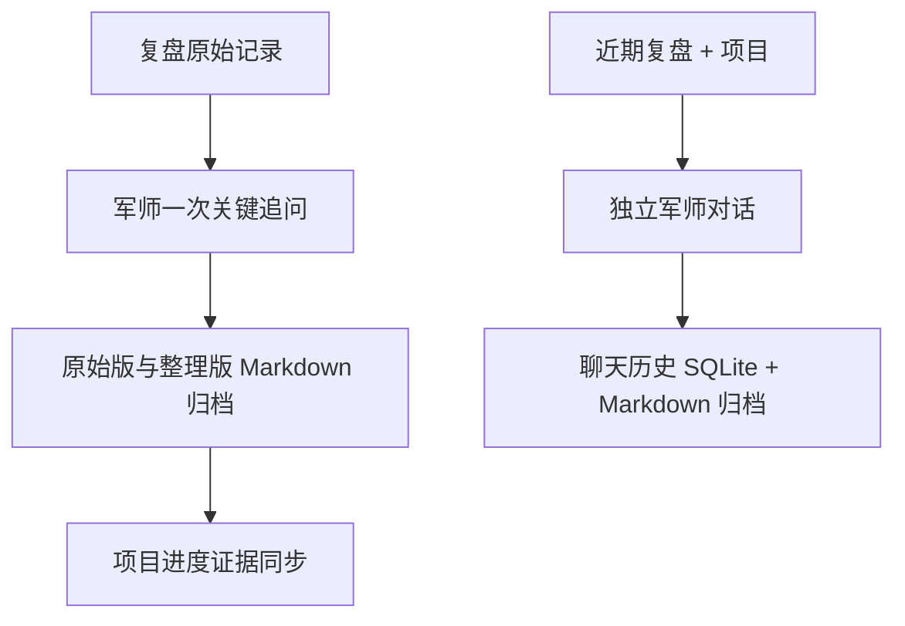

# 复盘军师 Agent｜搭建资料总览

这份文档是目前项目的唯一入口。它记录了需求来源、已实现功能、代码位置、模型配置、资料投放方式，以及下一阶段该从哪里继续。

## 1. 项目要解决什么

这不是普通日记或泛聊天机器人，而是 Jerry 的长期学习与生活军师。

军师需要做到：

1. 把每日复盘中的事实、感受、解释分开；
2. 只在必要时追问一个最能改变判断的问题；
3. 不把一次状态当作人格结论，而是在跨天、跨周证据中更新画像；
4. 发现问题后给出有适用条件、微动作、实验周期和复诊指标的方案；
5. 同步真实项目进度，并在非计划日只生成明日动作，不随意打乱周计划。

完整的原始共识在：

- [复盘军师需求共识](../../系统/3-方向盘/复盘系统/复盘军师需求共识-2026-07-26.md)
- [复盘军师 Agent 实施手册](../../系统/3-方向盘/复盘系统/复盘军师Agent实施手册.md)
- [开发启动规格](开发启动规格.md)

## 2. 当前可运行闭环



桌面应用当前有五个入口：

| 入口 | 当前用途 | 数据落点 |
|---|---|---|
| 复盘 | 写流水账、接受一次一个问题的追问、完成归档 | SQLite + `每日复盘/原始记录`、`每日复盘/整理记录` |
| 军师对话 | 自由讨论学习、决策、拖延、项目问题 | SQLite + `军师对话/` Markdown |
| 历史 | 按日期查看已保存复盘 | SQLite 复盘线程 |
| 进度 | 查看真实项目、下一步与完成证据 | `进度/项目进度.json` |
| 画像 | 目前只展示原则；尚未自动写入长期画像 | 待第二阶段实现 |

## 3. 已实现的技术结构

```text
Electron 桌面壳
  ├─ React + Vite 前端（写作 / 聊天工作台）
  └─ FastAPI 本地服务（仅 127.0.0.1）
       ├─ LangGraph 复盘追问流程
       ├─ NVIDIA NIM / OpenAI 兼容模型调用
       ├─ SQLite：复盘线程、聊天线程、聊天消息
       ├─ Markdown：复盘与聊天归档
       └─ JSON：项目进度
```

当前模型使用 NVIDIA NIM 的 OpenAI 兼容接口。模型能生成单一追问与聊天回复，但云端首个回复约需 40–50 秒。现在是“等待完整回复”模式，尚未实现 token 流式显示。

## 4. 关键资料与代码地图

### 产品、协议、Skill

| 资料 | 作用 |
|---|---|
| `D:/Jerry的知识库/.agents/skills/review-adviser/SKILL.md` | 统一入口，定义复盘 → 诊断 → 进度 → 计划 → 归档的长流程 |
| `D:/Jerry的知识库/.agents/skills/daily-interactive-review/SKILL.md` | 每日交互式复盘的提问与成稿协议 |
| `D:/Jerry的知识库/.agents/skills/problem-diagnosis-learning/SKILL.md` | 跨期问题诊断和干预要求 |
| `D:/Jerry的知识库/.agents/skills/personal-profile/SKILL.md` | 个人画像加载与谨慎更新原则 |
| [开发启动规格](开发启动规格.md) | 受约束 RAG、证据卡、计划守卫的目标设计 |

### 后端

| 文件 | 责任 |
|---|---|
| [main.py](backend/app/main.py) | FastAPI 路由：复盘、项目、独立聊天 |
| [brain.py](backend/app/brain.py) | 模型提示词、单一追问、自由军师回复、失败降级 |
| [graph.py](backend/app/graph.py) | LangGraph 复盘问答暂停与恢复 |
| [store.py](backend/app/store.py) | SQLite 表与读写：复盘、聊天、消息 |
| [archive.py](backend/app/archive.py) | Markdown 原始复盘、整理复盘、聊天归档 |
| [progress.py](backend/app/progress.py) | 项目 JSON 与复盘完成证据同步 |
| [config.py](backend/app/config.py) | D 盘运行路径与模型配置读取 |
| [schemas.py](backend/app/schemas.py) | 前后端 API 数据契约 |

### 前端与桌面壳

| 文件 | 责任 |
|---|---|
| [App.tsx](vendor/vinaya-journal/desktop/src/App.tsx) | 复盘、聊天、历史、进度、画像的主交互 |
| [App.css](vendor/vinaya-journal/desktop/src/App.css) | 写作优先的桌面工作台样式 |
| [main.cjs](desktop/main.cjs) | Electron 启动 FastAPI 与 Vite，并把缓存重定向到 `runtime/` |
| [启动复盘军师.cmd](启动复盘军师.cmd) | 日常双击启动入口 |
| [Vinaya LICENSE](vendor/vinaya-journal/LICENSE) | 当前前端视觉基础的 MIT 许可证 |

旧的 `vendor/charlietlamb-calendar/` 是早期日历模板尝试，现已不作为运行主界面；保留它仅供参考。

## 5. 本地数据与资料投放

### 用户数据

| 内容 | 位置 |
|---|---|
| 原始复盘 | `系统/3-方向盘/复盘系统/每日复盘/原始记录/` |
| 整理复盘 | `系统/3-方向盘/复盘系统/每日复盘/整理记录/` |
| 军师聊天 | `系统/3-方向盘/复盘系统/军师对话/` |
| 项目进度 | `系统/3-方向盘/复盘系统/进度/项目进度.json` |
| SQLite 数据库 | `apps/review-adviser-agent/runtime/data/review_agent.db` |

### 给军师的资料

在 [投放给军师](投放给军师/README.md) 下投放：

- `军师参考资料/`：书籍摘录、研究、学习方法、视频转写；将来作为受约束 RAG 的唯一外部参考来源。
- `待整理复盘/`：旧日记、周复盘、月复盘，后续摄入并建立证据。
- `界面参考/`：产品截图、链接、草图。
- `模型配置/`：示例配置。
- `大模型的API.env`：真实 API 配置，只留在本机，Git 永不提交。

当前 NVIDIA NIM 配置格式：

```env
LLM_BASE_URL=https://integrate.api.nvidia.com/v1
LLM_API_KEY=nvapi-你的密钥
LLM_MODEL=deepseek-ai/deepseek-v4-pro
```

## 6. C 盘约束与启动

所有应用运行数据、Electron 用户数据、npm 缓存、SQLite、Python 缓存都使用：

```text
D:\Jerry的知识库\apps\review-adviser-agent\runtime\
```

日常启动：双击 [启动复盘军师.cmd](启动复盘军师.cmd)。

调试后端：运行 `scripts/start-local.ps1`，然后打开 `http://127.0.0.1:8766`。

## 7. 已知限制（不要误认为已完成）

1. 独立军师对话尚未逐字流式输出；模型慢时会等待完整回复。
2. 目前聊天只携带近期复盘摘要和项目摘要，不是完整个人画像检索。
3. 尚未实现事实切片、证据卡、跨 3—7 天趋势、正式问题诊断。
4. 尚未实现受约束 RAG、知识卡审核、向量检索和来源引用。
5. 尚未实现微实验、复诊、计划日守卫与自动明日计划。
6. “转为复盘 / 同步进度 / 写入画像”按钮与人工确认流程尚未做。

## 8. 建议的下一步顺序

1. 给聊天和复盘增加 SSE 流式输出，先解决等待体验；
2. 定义“聊天结论转为复盘 / 项目证据 / 待观察假设”的人工确认动作；
3. 实现事实切片与证据卡，不直接更新人格画像；
4. 摄入第一批 10—30 张经过审核的干预知识卡；
5. 实现 SQLite FTS5 + 向量检索 + RRF 的受约束 RAG；
6. 最后才实现跨期诊断、微实验、复诊和计划守卫。

## 9. Git 与版本

- GitHub 仓库：<https://github.com/zhangryan0236-lab/jerry-knowledge-base>
- 当前开发分支：`codex/review-adviser-workbench`
- 最近提交重点：桌面工作台、NVIDIA NIM 接入、独立军师对话。

密钥、`runtime/`、`node_modules/` 均不进入 Git。
