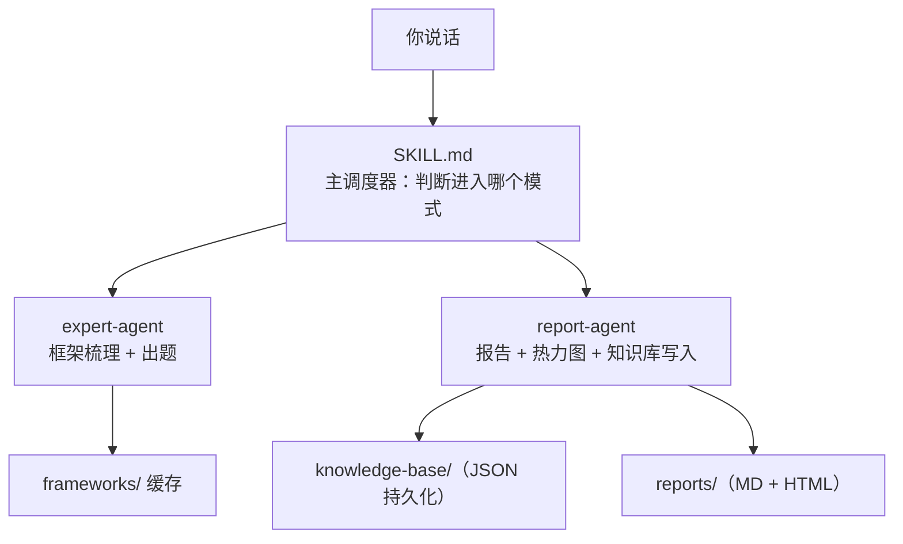
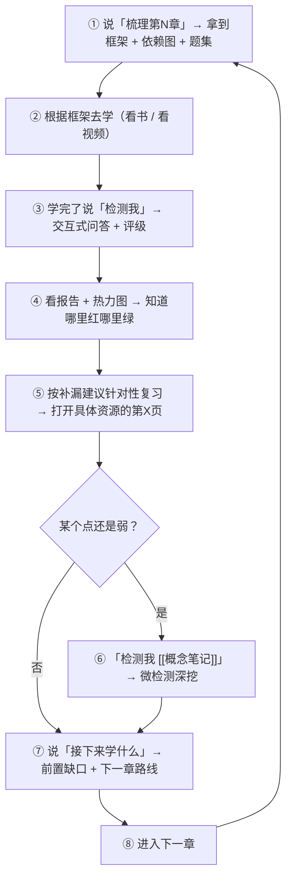

# knowledge-check 技能使用说明书

> 一份给 Jerry 的完整使用指南——不只是"怎么用"，还包括它好在哪、差在哪、以及你能怎么让它更好。

---

## 一、这是什么

**一句话**：一个跑在 Claude Code 里的 AI 学习教练。你告诉它你在学什么，它帮你梳理框架、出题检测、识破假装理解、生成可视化报告、推荐学习路线——所有检测结果跨会话持久化，关了对话重开它还认得你。

**核心哲学**：检测是为了诊断，诊断是为了精准施教。它不是考官，是一面镜子。

---

## 二、系统架构（你不需要操作，但你需要知道）



**三层设计**：
- **调度层**：SKILL.md 负责路由用户输入到正确的模式
- **执行层**：两个子代理处理重任务（框架生成、报告生成），不阻塞主对话
- **持久层**：knowledge-base/ JSON 文件跨会话记忆你的掌握程度

### 子代理说明

| 子代理 | 文件 | 做什么 | 运行方式 |
|--------|------|--------|---------|
| expert-agent | `agents/expert-agent.md` | 根据科目切换专家 persona，拆解框架，出检测题 | 同步（你得等） |
| report-agent | `agents/report-agent.md` | 生成 9 板块 Markdown 报告 + HTML 热力图 + 写知识库 | **后台**（不用等，主对话继续） |

---

## 三、五个模式速查

| # | 模式 | 你说什么 | 它干什么 | 耗时 |
|---|------|---------|---------|------|
| 0 | 初始化 | 不用主动说，第一次提科目时自动触发 | 问范围→问目标→问资料→搭全局框架 | 30秒 |
| 1 | 专家 | "帮我梳理 X" | 拆知识点→打标签→画依赖图→出题集 | ~30秒 |
| 2 | 检测 | "检测我" | 出题→自适应难度→识破9种假装理解→评级 | 5-10分钟 |
| 3 | 报告 | 检测完自动触发 | 生成 MD 报告 + HTML 热力图 | 后台跑，不占你时间 |
| 4 | 导航 | "接下来学什么" | 前置检查→后续路线→横向关联→优先级矩阵 | ~20秒 |
| 5 | 总览 | "给我总览" | 跨章节掌握率热力图 + 全局总结 | ~30秒 |

### 模式二还有两个变体

- **完整检测**（5-8题）：检测一整章。覆盖重点→难点→易错点→偏点
- **微检测**（2-4题）：检测一个概念。覆盖概念本质→概念关联→适用边界→应用

---

## 四、完整学习循环（照这个走）



---

## 五、优点分析

### 5.1 学习科学层面

**① 9 种假装理解识别——这是这个技能最硬核的部分**

| 伪装 | 典型表现 | 拆穿方式 |
|------|---------|---------|
| 术语护盾 | 满口术语，大白话解释不了 | "给你奶奶解释一下" |
| 循环论证 | 用问题里的词解释问题 | "你到底在说什么" |
| 概念混淆后圆场 | 两个概念搞混了，用更多话补 | 强制分开说清楚 |
| 过度泛化 | "要看具体情况"式万金油 | 追问这个具体情境 |
| 选择性回避 | 只答会的，跳过不懂的 | 指着跳过的地方问 |
| 错误但过度自信 | 错得离谱但语气笃定 | "如果反过来呢？" |
| 步骤复读机 | 能写步骤但说不出为什么 | "这步为什么不用别的方法？" |
| 公式依赖症 | 公式倒背如流但不懂含义 | "用最土的话说它在算什么" |
| 看答案就懂了 | 声称会了但唯一证据是看懂答案 | "不看资料，口述思路" |

这 9 种模式覆盖了自学中最常见的自欺方式。尤其 #7 步骤复读机和 #8 公式依赖症，是刷题党的经典死穴。

**② 自适应难度（下沉三层钻探）**

答不好不急着判死刑——先降级问前置概念，再不会继续下沉，最多三层。这避免了"一题否决"的粗暴判断，能精准定位断点在哪。

**③ 内容类型自动切换策略**

数学类不给选择题、追问每步前提条件；概念类递进问本质→关联→边界→应用；播客类区分"被娱乐了"和"真学到了"；实用书籍类区分"知道道理"和"真的会用"。

**④ 个性化出题加权**

读取你的薄弱科目列表、思维盲区、近期学习状态日记——如果最近处于低动力期，第一题温和些；如果科目在你薄弱列表里，优先追问概念本质而非计算。

### 5.2 工程层面

**⑤ 子代理委托，不阻塞主对话**

框架生成用同步子代理（你需要等），但报告 + HTML 生成用**后台子代理**——你继续看报告摘要，它后台写文件。这个设计合理。

**⑥ 跨会话知识图谱持久化**

所有检测结果写入 `knowledge-base/{科目}.json`，下次开新对话自动加载。不用每次重新自我介绍。

**⑦ 框架缓存（30天有效期）**

梳理过的章节框架缓存到 `frameworks/`，30 天内不重复生成。省 Token。

### 5.3 教学哲学层面

**⑧ 宁严勿宽 + 不表扬**

"答对就说'对，到位了'，不加表扬。没懂就说'没理解'"——这比"你好棒！只差一点点！"式的伪鼓励有效一百倍。直接反馈降低认知负荷。

**⑨ 内耗信号检测**

四信号（完美主义/照本宣科/疑似作弊/长文自我批评）+ 四内耗场景（效率不高→长文→更焦虑 / 方法论怀疑→中断计划 / 存在审判预演 / 鸡血递减→全面熄火）——这是针对你个人定制的保护机制。

---

## 六、缺点与局限

### 6.1 架构层面

**① 强依赖 memory 文件体系**

如果 `MEMORY.md`、`user-profile.md`、`feedback-guiding-jerry.md` 任何一个读取失败，降级运行后个人化效果大打折扣。整个系统的"灵魂"绑在一组外部文件上——文件丢了或被移动，它就不再认识你了。

**② 知识库 JSON 结构扁平**

当前结构是 `科目 → 章节 → detection → knowledge_points`。没有概念间的关系图。比如"Hook"这个概念出现在"Agent开发"里，但它和"Git Hook"（可能出现在另一个科目里）是同一个概念的不同应用场景——当前结构无法表达这种跨章节、跨科目的概念关联。

**③ 报告生成的 HTML 热力图是字符串替换**

`report-agent.md` 用的是模板占位符替换而非结构化生成。如果模板改了但占位符名没同步，或者占位符中的内容包含 HTML 特殊字符没转义，热力图会炸。这不算 bug 但脆弱。

**④ 没有检测间隔/spaced repetition 机制**

检测完就完了。没有"你 3 天前检测过 Hook，建议今天重测"的提醒。知识库有历史数据但缺少主动召回逻辑。

### 6.2 体验层面

**⑤ 模式零（全局框架初始化）容易被跳过**

大多数用户第一次用会说"检测我"而不是"我要学数据结构"，系统只好跳过框架直接进入单章检测。跳过后，模式四（导航）就无法做前置依赖分析。这是设计上的先有鸡还是先有蛋问题。

**⑥ expert-agent 科目覆盖有限**

只有约 10 个预定义专家 persona（高数/线代/概率/数据结构/计组/计网/OS/ML/哲学），其他所有科目降级为"通识学习方法专家"。vibecoding、Agent开发等新兴领域不在覆盖范围内，框架质量会打折扣。

**⑦ 后台子代理失败没有用户感知**

report-agent 在后台运行。如果它失败了（比如模板文件路径不对、JSON 写入权限有问题），用户不会立刻知道。目前只能靠你主动去看 `reports/` 目录有没有生成文件。

**⑧ 全文本交互，没有丰富的输入方式**

只能打字。不能"拍一张题发过去检测我"。不能语音输入。这对于数学类用户（需要手写公式）是个显著门槛。

### 6.3 检测逻辑层面

**⑨ 微检测评分精度太粗**

微检测只有三档：✅=0.85, ⚠️=0.55, ❌=0.2。这个粒度对于"跟踪一个概念从完全不懂到基本理解然后到完全掌握"的渐进过程来说太粗了。0.55 到 0.85 之间是一个巨大的断档。

**⑩ 没有"开始检测前先回顾上次薄弱点"的机制**

每次检测都是独立的——不会自动在出题前说"上次你在这里卡住了，我先问一个相关的看你补上了没有"。数据在那里，但检测流程没有利用跨会话的历史。

**⑪ 出题质量依赖 expert-agent 的能力上限**

如果 expert-agent 对某个领域不熟，出的题可能不够痛。用户无法区分"我答对了是因为我真懂了"还是"题太简单了没问到痛处"。

---

## 七、可优化的地方（优先级排序）

### 🔴 高优先级（改动小、收益大）

**1. 检测前自动回顾上次薄弱点**

在模式二开头加一步：读取 knowledge-base，如果发现该章之前检测过且有 score < 0.5 的知识点，先出一道回顾题。答对了→记录进步；答错了→定位"补了但没补上"的问题。

**2. 给 vibecoding 等新兴领域加 expert-agent persona**

目前 expert-agent.md 里没有"vibecoding/Agent开发/Claude Code"相关的专家 persona。加一个，哪怕比较初步，也比降级到"通识学习方法专家"强。

**3. 检测结束后的微行动提醒支持定时**

当前报告最后给出"明天要做什么"，但没有任何提醒机制。可以结合 Claude Code 的 Cron 或定时功能，在第二天弹一个"今天的微行动：做天勤第12页例1.3"。

### 🟡 中优先级（需要一定改动量）

**4. 概念级知识图谱**

在 knowledge-base 中增加一个 `concepts.json`，记录概念间的交叉关系（如 `Hook → 关联 → pipeline() → 关联 → Subagent`）。这样总览不只能按章节看，还能按概念网络看。

**5. Spaced Repetition 主动召回**

实现简单版：每次检测前检查 knowledge-base，找出 7 天前检测过的章节中 score 最低的 3 个概念，提示"这几个概念已 7 天未检测，要回顾吗？"

**6. 微检测评分粒度细化**

从 3 档（0.85/0.55/0.2）改为 5 档（0.9/0.7/0.5/0.3/0.1），对应：脱口而出 / 能说清但需思考 / 方向对但有模糊 / 关键点搞混 / 完全不会。

### 🟢 低优先级（大工程，锦上添花）

**7. 报告导出为 Anki/Quizlet 卡片**

把薄弱知识点自动转成抽认卡格式，导入 Anki 做间隔复习。

**8. 学习时间追踪**

让用户可选地记录每章花了多少小时。结合掌握率，可以算"学习效率"（掌握率/小时），帮你优化时间分配。

**9. 多模态输入**

支持"拍照发题"——拍一张课本习题，系统识别后纳入出题范围。

---

## 八、你该怎么用（场景速查表）

### 按场景

| 你想做什么 | 你说 | 注意事项 |
|-----------|------|---------|
| 开始学一整本书 | 说科目名 + 目标 | **先走模式零**：说清楚范围/目标/资料，别跳过。跳过后面导航就废一半 |
| 学完一章 | "检测我" | 如果之前梳理过框架，检测会基于框架出题；没有框架就基于你的概括出题 |
| 学完一个概念 | "检测我 Hook" | 走微检测模式，2-4 题快速确认 |
| 不确定该补哪里 | "给我总览" | 看全局掌握率热力图，找红色区域 |
| 不知道下一章学什么 | "接下来学什么" | 会做前置依赖检查 + 优先级矩阵 |
| 学完一轮想规划二轮 | "帮我规划二轮" | 前提是已有 ≥2 章检测记录，少于 2 章不触发 |
| 看了播客/视频 | "检测我" | 系统会切换到播客类策略，追问核心论点而非概念定义 |

### 按学习类型

| 类型 | 适合的模式 | 为什么 |
|------|----------|--------|
| 考研408/数学 | 模式零 → 模式一 → 模式二 → 模式三 → 模式四 | 完整闭环，一章一章啃 |
| vibecoding/工具学习 | 微检测模式 | 概念粒度小，不需要整章框架 |
| 阅读/播客 | 微检测模式 | 区分娱乐和学习 |
| 长期跟踪一个技能 | 模式五（定期总览） | 看趋势、找退步的领域 |

### 你实操中的三个坑（已经踩过）

**坑 1：跳过模式零直接检测**

后果：没有全局学习框架 → 导航模式无法做前置依赖分析 → 报告只说"本章"不说"本章在整个体系中的位置"。

**正确做法**：第一次接触一门课时，花 30 秒走一遍模式零。三个问题回答完就行。

**坑 2：检测答对了就不管了**

后果：微检测分数 0.85 不代表"永远会了"。0.85 = "这次检测时能说清"。一周后可能退化到 0.5。

**正确做法**：定期说"给我总览"，看哪些概念上次检测后很久没回顾。

**坑 3：只检测不补漏**

后果：检测了 Hook（✅），但 `pipeline()` 还没学过就跳过去了。知识库里 pipeline 的 score 是 0.55，但你没主动去查。

**正确做法**：每次检测完看报告的行动方案，挑一个 🔴 优先做。做完再测。

---

## 九、你还能怎么优化（进阶）

### 9.1 给 knowledge-base 手动补数据

当前 knowledge-base/ 是纯自动维护的。你可以手动加东西：

- 在 `Agent开发.json` 里看到 score 0.55 的 `pipeline()`——你可以主动加一个 `"manual_note": "已看完 B 站视频 P23，理解程度自评 0.7"`，下次检测时提醒我优先问这个
- 在 `_index.json` 里加 `"goals": {"408": "12月底前完成一轮", "vibecoding": "7月底前跑通第一个 Workflow"}`

### 9.2 和 Obsidian 笔记联动

你已经有 `wiki/检测报告/knowledge-check-Obsidian集成实施报告.md`。可以按那个模式：

- 每次检测完，把判定写回 Obsidian 笔记的 YAML frontmatter
- 用 Dataview 在 Obsidian 里汇总所有概念的掌握度
- 检测时 @ 笔记 → 系统读取笔记原文出题（比凭空出题更精准）

### 9.3 用 CLAUDE.md 写快捷路由

在你的 Vault 的 CLAUDE.md 里已经有 knowledge-check 的路由规则。可以用同样的方式加更多触发词：

```markdown
| "今晚测" | 走微检测模式，只出 2 题，5 分钟内结束 |
| "深度检测" | 走完整检测模式，8 题上限，所有维度覆盖 |
```

### 9.4 跨技能联动

你有一套技能体系（`conversation-journal`、`knowledge-check`、`jerry-moments-writer`）。可以让它们联动：

- 每次 conversation-journal 复盘后，自动检查"今天有没有检测过某个概念"——如果没有，提醒："今天学了 X，要检测吗？"
- knowledge-check 发现某个思维盲区反复出现（如"术语护盾"），写入 user-profile，trigger conversation-journal 在下次复盘中专门关注

---

## 十、一句话总结

> **knowledge-check 是一把好刀——但它只能告诉你哪里没切开，不能代替你去切。检测 5 分钟，补漏可能要 2 小时。别把"检测过了"当成"学过了"。**

```
检测 ≠ 学习
检测 = 镜子
学习 = 你站在镜子前看清自己后，回去继续练
```

---

*写于 2026-07-20，基于 knowledge-check skill v1.0 全文 + 子代理文件 + 模板 + 记忆系统 + 知识库的完整分析。*
