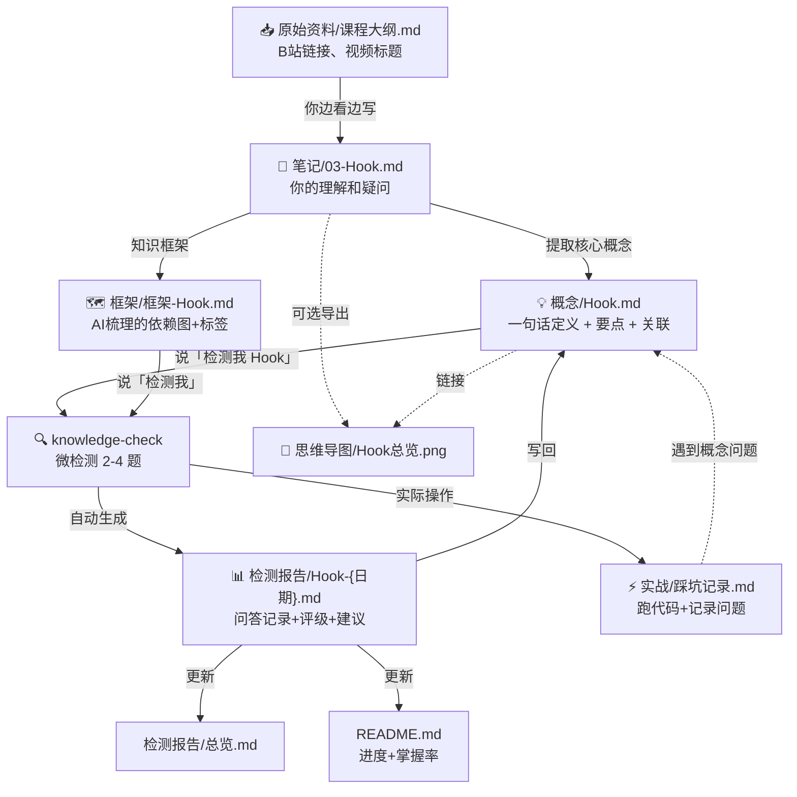

# 学习仓库搭建指南

> 配套 knowledge-check 交互式学习流程。每开一个新科目，照这个结构 30 秒搭好。

---

## 一、设计原则

在动手建文件夹之前，先搞清楚**为什么这样建**。

### 四个核心原则

| 原则 | 说明 | 反面教材 |
|------|------|---------|
| **笔记和报告分离** | 你写的笔记 ≠ AI 生成的报告。它们放在不同文件夹，互不污染 | 笔记和报告混在一起，三周后分不清哪个是你写的哪个是 AI 写的 |
| **原始资料不可变** | 课程链接、别人笔记的 Clippings、视频大纲 → 只读，只增不改 | 在原始资料上直接批注，导致原文不可追溯 |
| **概念页是枢纽** | 每个核心概念一个 .md 文件，链接到笔记、报告、思维导图——它是导航中心 | 概念分散在笔记各处，没有一个"官方定义"页面 |
| **入口文件一目了然** | 打开科目文件夹，第一眼看到 README → 知道"学到哪了、哪里弱、下一步干什么" | 打开文件夹一片文件列表，不知道从哪点起 |

### 这套结构解决的问题

```
以前：学完 → 检测 → 报告生成 → 报告在哪？→ 找到了但笔记在哪？→ 忘了。

现在：打开科目文件夹 → README 显示进度 → 概念页有每个概念的 mastery 分数
      → 检测报告按时间排列 → 思维导图和笔记分门别类 → 一目了然。
```

---

## 二、标准目录结构

每开一个新科目，创建以下结构：

```
{科目名}/                       ← 如"Agent开发"、"数据结构"、"高等数学"
│
├── README.md                   ← 科目仪表盘（进度、掌握率、薄弱点）
│
├── 笔记/                       ← 你自己的学习笔记（看视频/读书时写）
│   ├── 01-{章节名}.md
│   ├── 02-{章节名}.md
│   └── ...
│
├── 概念/                       ← 核心概念的深度页（一个概念一个文件）
│   ├── {概念A}.md
│   ├── {概念B}.md
│   └── ...
│
├── 检测报告/                   ← knowledge-check 每次检测生成
│   ├── 检测报告-{章节}-{日期}.md
│   ├── 检测报告总览.md         ← 该科目所有检测的索引
│   └── 热力图/                 ← HTML 热力图（可选，看是否生成）
│
├── 框架/                       ← expert-agent 梳理的知识框架（或放笔记里）
│   └── 框架-{章节}.md
│
├── 思维导图/                   ← 导出的图片或 Obsidian Canvas 文件
│   ├── {主题}-总览.png
│   └── {主题}-细节.canvas
│
├── 原始资料/                   ← 不可变：课程链接、Clippings、大纲
│   ├── 课程大纲.md
│   ├── 资源链接.md
│   └── Clippings/              ← 从 B站/网页 摘录的内容
│
└── 实战/                       ← 动手做的东西（代码、项目文件、踩坑记录）
    ├── 踩坑记录.md
    └── {项目名}/
```

### 结构选择的原因

| 文件夹 | 谁写 | 频率 | 为什么放这而不是放 raw/ 或 wiki/ |
|--------|------|------|------|
| README.md | AI 帮你维护 | 每次检测后更新 | 它是一个科目的**入口**，必须有 |
| 笔记/ | 你 | 每次学习 | 你的手写笔记，和 AI 报告分开 |
| 概念/ | AI + 你 | 每个核心概念 | 概念是枢纽——链接笔记、报告、思维导图 |
| 检测报告/ | AI（knowledge-check） | 每次检测 | 纯 AI 生成，不改。按时间排列方便看趋势 |
| 框架/ | AI（expert-agent） | 每章开始前 | 学习地图，30 天内缓存有效 |
| 思维导图/ | 你（手动导出） | 每章或每个主题 | 图片文件，不污染 Markdown 目录 |
| 原始资料/ | 不可变 | 课程开始前 | 只读，不修改。需要标注去笔记/里写 |
| 实战/ | 你 | 边学边做 | 代码和项目不适合放 Markdown 文件夹 |

---

## 三、每个文件长什么样

### 3.1 README.md（科目仪表盘）

```markdown
---
tags: [{科目标签}, 学习项目]
created: {开始日期}
---

# {科目名} 学习仪表盘

> 目标：{一句话目标}
> 资源：{主要资料}
> 开始：{日期}

## 学习进度

| 章节 | 状态 | 笔记 | 检测日期 | 掌握率 | 报告 |
|------|------|------|---------|--------|------|
| Hook机制 | ✅ 已检测 | [[笔记/03-Hook.md]] | 07-20 | 85% | [[检测报告/检测报告-Hook-2026-07-20.md]] |
| Subagent基础 | 📝 笔记完成 | [[笔记/01-Subagent.md]] | - | - | - |
| pipeline() | 📖 学习中 | - | - | - | - |

## 薄弱点追踪

| 概念 | 当前掌握率 | 上次检测 | 补漏行动 |
|------|----------|---------|---------|
| pipeline()与Hook分工 | 55% | 07-20 | 看 B站 P24 并做笔记 |

## 全局掌握率：{X}%

已检测 {N}/{M} 个概念

## 待办

- [ ] 学 pipeline() 函数
- [ ] 动手写第一个 Workflow
```

**谁维护**：你每次学到新章节时手动更新状态列；AI 每次检测完自动更新检测日期、掌握率、报告链接。

### 3.2 笔记/（你的学习笔记）

```markdown
---
tags: [Agent开发, 学习笔记, {章节标签}]
created: YYYY-MM-DD
source: {视频链接或书名}
---

# {标题}

## 核心要点

- 要点 1：用大白话写
- 要点 2：不要抄书
- 要点 3：写你理解后的版本

## 我的问题

- 这里没懂：...
- 这里和之前学的 X 是什么关系？

## 关联概念

- [[../概念/Hook]] — 事件感应器
- [[../概念/Subagent]] — 临时子代理
```

**关键**：笔记里不要写 AI 生成的框架——那是 AI 的东西。笔记写**你自己的理解、自己的疑问、自己的关联**。

### 3.3 概念/（核心概念深度页）

```markdown
---
tags: [Agent开发, 概念, {概念标签}]
created: YYYY-MM-DD
aliases: [{别名}]
knowledge_check:
  last_detected: YYYY-MM-DD
  mastery: {分数}
  weak_points: [{薄弱点}]
---

# {概念名}

## 一句话定义

{用大白话说}

## 核心要点

1. {要点}
2. {要点}

## 和其他概念的关系

- [[Hook]] ← 这是被触发后执行的东西
- [[Subagent]] ← Hook 不管理 Subagent，pipeline() 才管
- [[pipeline]] ← 等所有 Subagent 完成的机制

## 我的理解（手写区）

> {用你自己的话重写一遍。这是最重要的部分}

## 检测记录

### [YYYY-MM-DD] ✅ 已理解 (85%)
| 知识点 | 得分 | 判定 |
|--------|------|------|
| ... | ... | ... |
```

**关键**：概念页是整个系统的**枢纽**。笔记链接到这里，检测报告链接到这里，思维导图也链接到这里。它是这个概念的"官方页面"。

### 3.4 检测报告/总览.md（该科目的检测索引）

```markdown
---
tags: [{科目}, 学习检测, 总览]
created: YYYY-MM-DD
---

# {科目名} 检测报告总览

## 检测统计

| 已检测概念 | 已理解 | 基本理解 | 未理解 |
|-----------|--------|---------|--------|
| {N} | {N} | {N} | {N} |

## 检测记录

| 日期 | 概念/章节 | 评级 | 报告 |
|------|----------|------|------|
| ... | ... | ... | ... |

## 薄弱点追踪

{score < 0.5 的概念及补漏建议}

## 待检测清单

- [ ] {还没检测的概念}
```

与 [[../README.md]] 的区别：
- README = 整个科目的仪表盘（学习进度 + 检测进度 + 待办）
- 检测报告总览 = 只关注检测维度的索引（纯粹的报告目录）

---

## 四、数据流向

一个概念的完整生命周期，如何在文件夹之间流转：



**关键流程节点**：

| 步骤 | 触发方 | 产物 | 存放位置 |
|------|--------|------|---------|
| 课程开始 | 你 | 大纲、链接收集 | `原始资料/` |
| 学习过程 | 你 | 手写笔记 | `笔记/` |
| 框架梳理 | AI（模式一） | 知识框架 | `框架/` 或 `笔记/` 底部 |
| 概念提炼 | AI + 你 | 概念页 | `概念/` |
| 检测 | AI（模式二） | — | — |
| 报告生成 | AI（模式三） | 检测报告 | `检测报告/` |
| 复习 | 你 | — | 看 `概念/` 里的 mastery 分数 |
| 总览 | AI（模式五） | — | 读 `检测报告/总览.md` |

---

## 五、与 Obsidian 的联动技巧

### 5.1 笔记中嵌入概念页

在 `笔记/03-Hook.md` 中写：

```markdown
## Hook 机制

见 [[../概念/Hook|Hook 概念页]]（掌握率 85%）
```

这样笔记里不用重复写概念定义——点进去就是最新版本的概念页。

### 5.2 概念页底部用 Dataview 追踪

在 `概念/Hook.md` 底部：

```markdown
## 相关笔记
\```dataview
LIST
FROM "Agent开发/笔记"
WHERE contains(file.outlinks, [[]])
\```

## 最近检测
\```dataview
TABLE mastery, last_detected, weak_points
FROM "Agent开发/概念"
WHERE file.name = "Hook"
\```
```

### 5.3 Canvas 放在思维导图文件夹

`思维导图/Hook-Subagent-pipeline.canvas`：

直接把 Obsidian Canvas 文件放在这个文件夹，拖拽笔记、概念页、检测报告到画布上，可视化它们的关系。

### 5.4 用 YAML 做跨文件追踪

所有文件统一用这些 frontmatter 字段：

```yaml
---
tags: [Agent开发, {文件类型}]  
# 文件类型：学习笔记 | 概念 | 检测报告 | 框架 | 原始资料
created: YYYY-MM-DD
source: {可选的来源链接}
---
```

这样用 Dataview 可以快速过滤："Agent开发里所有还没检测的概念"。

---

## 六、新建科目清单（30 秒搭好）

每开一个新科目，顺序执行：

```
1. 创建文件夹结构（复制最上面的模板）
2. 写 README.md（目标 + 资源 + 进度表骨架）
3. 创建 原始资料/资源链接.md（把课程链接、书名丢进去）
4. 说「我要学{科目名}，目标{目标}，资料{资料}」
   → 系统触发模式零，建立全局学习框架
5. 开始学第一章
   → 笔记写进 笔记/01-xxx.md
   → 核心概念提炼到 概念/xxx.md
   → 说「检测我」→ 报告自动进 检测报告/
```

**判断结构是否正确的自检**：三周后打开这个文件夹，能不能在 5 秒内找到"第三章的检测报告"、"Hook 的当前掌握率"、"下一步该学什么"？能→结构对了。不能→多了或少了什么。

---

## 七、一个完整实例（以你现有的 Agent开发 为例）

你现在的 `raw/vibecoding-笔记/` 已经有一些文件了。如果要按这套结构重组：

### 现在的状态

```
raw/vibecoding-笔记/
├── Agent开发实战.md          ← 混合：笔记 + AI 补充内容 + 案例
├── 环境搭建.md               ← 笔记（内容很简略）
├── 工程化控制.md             ← 笔记
├── 检测报告-Hook-2026-07-20.md ← 检测报告
└── 检测报告总览.md           ← 总览
```

**问题**：笔记、AI 生成内容、检测报告混在一个文件夹。三周后分不清。

### 重组方案

```
Agent开发/                           ← 新建科目文件夹
├── README.md                       ← 新建仪表盘
├── 笔记/
│   ├── 01-环境搭建.md              ← 从 raw/ 迁移
│   ├── 02-工程化控制.md            ← 从 raw/ 迁移
│   └── 03-Agent开发实战.md         ← 从 raw/ 迁移，拆分 AI 内容
├── 概念/
│   ├── Hook.md                     ← 从 Agent开发实战.md 提取
│   ├── Subagent.md                 ← 从 Agent开发实战.md 提取
│   └── pipeline.md                 ← 新建（待学）
├── 检测报告/
│   ├── 检测报告-Hook-2026-07-20.md ← 从 raw/ 迁移
│   └── 检测报告总览.md             ← 从 raw/ 迁移 + 更新
├── 原始资料/
│   ├── B站课程大纲.md              ← 新建，把视频列表丢进去
│   └── Clippings/                  ← 存放已有的 Bilibili 摘录
├── 框架/                           ← 空，等 expert-agent 梳理
└── 思维导图/                       ← 空，等你导出
```

### 要不要迁移？

**我的建议**：不要迁移。你现在的文件分布是历史状态，没坏就别动。**从下一个新科目开始**用这套结构。Agent 开发这边，只在 `raw/vibecoding-笔记/` 基础上补一个 `README.md` 做入口就行。

---

## 八、文件命名规范

统一命名，Dataview 和搜索才能精准匹配：

| 文件类型 | 命名格式 | 例子 |
|---------|---------|------|
| 笔记 | `{序号}-{标题}.md` | `03-Agent开发实战.md` |
| 概念 | `{概念名}.md` | `Hook.md` |
| 检测报告 | `检测报告-{概念}-{日期}.md` | `检测报告-Hook-2026-07-20.md` |
| 检测总览 | `检测报告总览.md` | （固定名） |
| 框架 | `框架-{章节}.md` | `框架-Hook机制.md` |
| 思维导图 | `{主题}-{类型}.{扩展名}` | `Hook-Subagent-关系图.png` |
| README | `README.md` | （固定名） |

---

## 九、这套结构不适合什么

| 场景 | 为什么不适合 | 替代方案 |
|------|-------------|---------|
| 只学一个概念（不做长期跟踪） | 建一整套文件夹是杀鸡用牛刀 | 直接写一篇笔记，检测报告放旁边就行 |
| 随手记录、没有学习目标 | 没目标不需要仪表盘 | 用 fleeting notes（临时笔记）+ 定期清理 |
| 纯实战项目（coding 为主） | 概念/检测/报告 对纯代码项目太重 | 用 Git 仓库 + README 就够了 |

**判断标准**：如果一门课你预计要学 **≥5 个章节/概念** 且 **≥2 周**——值得建一套。否则就走轻量流程。

---

*指南基于 knowledge-check skill v1.0 的交互式学习流程设计。具体到你的 vibecoding 学习，我们会在对话中实时调整。*
