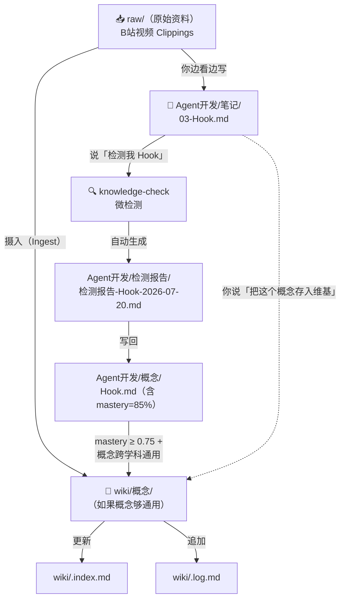

# 知识库双系统使用指南

> 帮你理清 **Karpathy Wiki 维基系统** 和 **knowledge-check 学习系统** 的关系——它们不是竞争关系，是上下游。

---

## 一、先看清你手里有什么

你有两个系统，各司其职：

| | Karpathy Wiki 系统 | knowledge-check 学习系统 |
|------|------|------|
| **位置** | `wiki/` + `raw/` | `{科目}/` + `~/.claude/skills/knowledge-check/` |
| **本质** | **永久知识库**（银行） | **学习工作台**（工厂） |
| **核心操作** | 摄入 → 查询 → 巡检 | 梳理 → 检测 → 报告 → 导航 |
| **谁维护** | AI 为主（你触发） | AI + 你协作 |
| **数据形态** | Markdown 概念页 + 索引 | JSON 知识库 + MD 报告 |
| **时间尺度** | 长期（数月/跨年） | 短期（一门课的周期） |
| **类比** | 你大脑的**外置硬盘** | 一门课的**学习教练** |

### 它们不是同一层的东西

```
┌─────────────────────────────────────────────────┐
│                  Wiki 维基系统                    │
│         永久知识库 · 跨学科 · 精选概念              │
│                                                 │
│   ┌─────────────┐  ┌─────────────┐              │
│   │ Agent开发    │  │ 数据结构     │  ... 更多科目 │
│   │ 学习工作台   │  │ 学习工作台   │              │
│   └─────────────┘  └─────────────┘              │
│          ↑                 ↑                     │
│     knowledge-check   knowledge-check            │
│     检测 · 报告 · 导航   检测 · 报告 · 导航        │
└─────────────────────────────────────────────────┘
```

**一句话**：你在科目文件夹里学，用 knowledge-check 检测，学扎实了之后，精华概念**晋升**到 wiki 成为永久资产。

---

## 二、数据流向：一个概念的生命周期

以你学 Agent开发 的 Hook 为例，看数据怎么在这两个系统之间流动：



**关键节点**：概念页有两种存在形式——

| 位置 | 性质 | 何时存在 |
|------|------|---------|
| `Agent开发/概念/Hook.md` | **学习中的草稿** | 边学边更新，mastery 在变化 |
| `wiki/概念/Hook.md` | **已沉淀的永久页** | mastery 稳定 ≥ 0.75 后晋升 |

同一个概念可以同时存在于两边——科目文件夹里的是"学习中版本"，wiki 里的是"精华版"。两者内容侧重点不同（见下文）。

---

## 三、什么东西放哪里

### 决策树

```
拿到一个新东西 →
  │
  ├─ 是学习资料（视频、文章、书）？
  │     ├─ 还没看 → 放 raw/ 或 科目/原始资料/
  │     └─ 看完了 → 笔记写 科目/笔记/，核心概念提炼到 科目/概念/
  │
  ├─ 是你自己的理解/总结？
  │     ├─ 和正在学的科目相关 → 科目/笔记/
  │     └─ 跨学科的洞察/反思 → wiki/学习系统/ 或 wiki/自我认知/
  │
  ├─ 是一个核心概念？
  │     ├─ 在学中，mastery 不稳 → 科目/概念/（草稿）
  │     ├─ 已掌握，且跨学科通用 → wiki/概念/（正式）
  │     └─ 已掌握，但仅限本科目 → 留在 科目/概念/，从 wiki 链接过来
  │
  └─ 是检测结果？
        └─ 科目/检测报告/
```

### 具体对照表

| 内容类型 | 放这里 | 不放这里 | 原因 |
|---------|--------|---------|------|
| B站视频 Clippings | `raw/Clippings/` | `科目/笔记/` | 原始资料不可变，不应混入手写笔记 |
| 看视频时的手写笔记 | `科目/笔记/` | `wiki/` | wiki 是精华版，不放学习中的半成品 |
| AI 梳理的知识框架 | `科目/框架/` 或 `科目/笔记/` 底部 | `wiki/` | 框架是学习工具，不是永久知识 |
| 一个概念的检测报告 | `科目/检测报告/` | `wiki/检测报告/` | 和科目的上下文绑定 |
| 一个已掌握的核心概念 | `wiki/概念/` | 仅放 `科目/概念/` | wiki 是跨科目的永久知识库 |
| 关于你自己学习方法的反思 | `wiki/学习系统/` | `科目/笔记/` | 这些反思超越任何单科 |
| 思维导图 | `科目/思维导图/` | `wiki/` | 导图是最佳的学习脚手架，不一定是最终知识形态 |
| 踩坑记录 | `科目/实战/` | `wiki/` | 踩坑是操作经验，不需要永久索引 |

---

## 四、两个系统如何配合：场景速查

### 场景 1：看完视频，想沉淀知识

```
你：「帮我摄入 [[raw/Clippings/Bilibili/xxx.md]]」

AI 执行 Ingest 流程：
  1. 读原始资料
  2. 和你讨论 2-3 个要点
  3. 在 wiki/ 或 科目/概念/ 写摘要页（看概念通用程度）
  4. 更新 wiki/.index.md
  5. 更新 wiki/.log.md

然后：
你：「检测我 Hook」→ knowledge-check 微检测这个概念的掌握程度
```

**谁做什么**：Wiki 负责**结构化存储**，knowledge-check 负责**验证理解**。

### 场景 2：学完一章，检测 + 沉淀

```
① 笔记已写在 Agent开发/笔记/03-Hook.md
② 核心概念已提炼到 Agent开发/概念/Hook.md

③ 你：「检测我 Hook」
   → knowledge-check 微检测 → 生成报告到 检测报告/
   → 报告写回 Agent开发/概念/Hook.md 的 YAML（mastery 更新）

④ 如果 mastery ≥ 0.75 → 评估：这个概念跨学科通用吗？
   → 通用 → 「把 Hook 概念存入 wiki」
     → AI 在 wiki/概念/ 创建 Hook.md（精华版）
     → 更新 wiki/.index.md + wiki/.log.md
   → 仅限本科目 → 留在 Agent开发/概念/Hook.md
     → wiki 只需链接过来（在 index 里加一条外部链接）
```

### 场景 3：横向关联，打通学科壁垒

```
你：「维基里关于 Hook 和 Git Hook 有什么关系？」

AI：
  1. 查 wiki/.index → 找到 wiki/概念/Git版本控制.md（提到 Git Hook）
  2. 查 Agent开发/概念/Hook.md（mastery 85%，有完整定义）
  3. 综合回答：两者都是"事件→自动执行"，但粒度不同……
  4. 你说：「把这个比较保存为页面」

结果：新页面 wiki/概念/Hook机制（跨学科）.md
     → 链接了 Git Hook 和 Claude Code Hook
     → 概念从「本科目概念」升级为「跨学科概念」
```

**这个场景是 Wiki 系统真正的价值**——当同一个概念在不同科目中出现，wiki 帮你建立连接，形成真正的知识网络。

### 场景 4：全局巡检

```
你：「巡检」

AI：
  1. 读 wiki/.index → 扫描所有页面
  2. 检查矛盾、过时、孤岛、缺失交叉引用
  3. 同时检查：哪些 科目/概念/ 里的东西 mastery ≥ 0.75 但还没晋升 wiki？
  4. 输出报告

你决定哪些要修，AI 执行。
```

---

## 五、两个概念页的区别：草稿 vs 正式

同一个概念"Hook"，在科目文件夹和 wiki 里的内容侧重点不同：

### 科目/概念/Hook.md（学习草稿）

```yaml
---
tags: [Agent开发, 概念, Hook]
knowledge_check:
  last_detected: 2026-07-20
  mastery: 85
  weak_points: ["与 pipeline() 的分工"]
---
# Hook

## 一句话定义
Hook 是事件感应器——当 X 发生时自动执行 Y。

## 我的理解（手写区）
> 来自一次检测的自我提炼：它是感应器，不改变 A 和 B，只做微小连接。

## 和 Agent开发 内其他概念的关系
- [[Subagent]] ← Hook 不管理它
- [[pipeline]] ← 这玩意儿才管等 Subagent

## 检测记录
### [2026-07-20] ✅ 已理解 (85%)
```

**特点**：重"我自己的理解"、含 mastery 数据、关联限于本科目内。

### wiki/概念/Hook.md（正式概念页，晋升后）

```yaml
---
tags: [概念, Hook, 事件驱动, 跨学科]
created: 2026-07-20
aliases: [钩子, Hook机制, 事件钩子]
sources:
  - Agent开发/概念/Hook.md
  - wiki/概念/Git版本控制.md
---
# Hook（钩子机制）

## 一句话定义
Hook 是一种事件驱动的触发机制：当指定事件发生时，自动执行预定义的操作。

## 核心要点
1. 无状态——来一条事件处理一条
2. 不改变事件本身——只在事件和响应之间做连接
3. 可以拦截（阻止后续操作）也可以只记录（旁路观察）

## 在不同场景中的应用
- **Claude Code**：PreToolCall Hook 拦截 git commit
- **Git**：pre-commit Hook 在提交前自动跑 lint
- **Vue/React**：生命周期 Hook（mounted, useEffect）

## 关联知识
- [[Git版本控制]] — Git Hook 是同一模式在版本控制中的实现
- [[Agent]] — Hook 是 Agent 工具调用链上的感应器

## 来源
- 学习检测记录：[[Agent开发/概念/Hook]]
- B站课程：[[raw/vibecoding-笔记/Agent开发实战.md]]
```

**特点**：重"跨场景通用定义"、含多个场景的实例、关联跨越本科目边界。

---

## 六、触发句速查

这里面有些是已有路由，有些是我建议新增的：

| 你想做的事 | 你说 | 触发系统 |
|-----------|------|---------|
| 摄入新资料 | `「摄入 [[文件]]」` | Wiki Ingest |
| 查一个概念 | `「维基里关于 X 都说了什么」` | Wiki Query |
| 比较两个概念 | `「帮我比较 A 和 B」` | Wiki Query |
| 保存对话中的好回答 | `「把这个答案存为维基页面」` | Wiki Ingest（归档） |
| 健康检查 | `「巡检」` | Wiki Lint |
| 梳理章节框架 | `「梳理 X」` | knowledge-check 模式一 |
| 检测一个概念 | `「检测我 X」` | knowledge-check 微检测 |
| 检测一章 | `「检测我」`（在科目上下文中） | knowledge-check 模式二 |
| 看全局掌握情况 | `「给我总览」` | knowledge-check 模式五 |
| 规划下一章 | `「接下来学什么」` | knowledge-check 模式四 |
| **晋升概念到 wiki** | `「把 X 概念存入 wiki」` | **需要新增路由** |
| **生成概念比较页** | `「比较 A 和 B，存为页面」` | Wiki Query + 归档 |

最后两个还没有路由规则，下面说怎么加。

---

## 七、建议你改的两个地方

### 7.1 在 CLAUDE.md 加两个路由

当前 CLAUDE.md 的「操作路由」表：

```markdown
| "把这个答案存为页面" | 将刚才的综合回答保存为维基新页面，更新 index 和 log |
```

建议加两条：

```markdown
| "把 [概念] 存入 wiki" 或 "晋升 [概念] 到维基" | 读取 科目/概念/{概念}.md，提取精华版写入 wiki/概念/，更新 index 和 log |
| "比较 [A] 和 [B]，存为页面" | 比较两个概念/事物，生成比较页存入 wiki/，更新 index 和 log |
```

### 7.2 在 wiki/.workflow.md 加「晋升」操作

在现有的三个操作（摄入/查询/巡检）之后加第四个：

```markdown
## ⬆️ 操作四：晋升（Promote）

### 什么时候做？
- knowledge-check 检测后，一个概念的 mastery ≥ 0.75
- 你觉得这个概念「不只是这门课的内容，是通用的」
- 你想让它出现在 wiki 的永久索引里

### 怎么做？
对 AI 说：「把 Hook 概念存入 wiki」

AI 执行：
1. 读取 科目/概念/Hook.md
2. 改写成 wiki 风格（跨学科、多场景、精炼版）
3. 写入 wiki/概念/Hook.md
4. 在 wiki/.index.md 对应分类下添加条目
5. 在 wiki/.log.md 追加：[日期] promote | Hook → wiki/概念/
```

---

## 八、一个完整实例：用 Agent开发 跑通双系统

假设你接下来学 **pipeline() 函数**：

```
第 1 步：看视频，做笔记
  → 写入 Agent开发/笔记/04-pipeline.md
  → 提炼核心概念到 Agent开发/概念/pipeline.md
  → 加上关联 [[Hook]]、[[Subagent]]

第 2 步：检测
  → 你：「检测我 pipeline」
  → knowledge-check 微检测
  → 报告：Agent开发/检测报告/检测报告-pipeline-{日期}.md
  → mastery 写回 Agent开发/概念/pipeline.md 的 YAML

第 3 步：判断要不要晋升
  → mastery 假设是 80%（≥ 0.75）
  → pipeline 是一个跨学科概念吗？
     → 是——CI/CD 有 pipeline，数据处理有 pipeline，Agent 编排有 pipeline
  → 你：「把 pipeline 概念存入 wiki」

第 4 步：AI 执行晋升
  → 读 Agent开发/概念/pipeline.md
  → 改写为 wiki 版（加上 CI/CD、数据工程的例子）
  → 写入 wiki/概念/pipeline.md
  → 更新 wiki/.index.md：「pipeline（流水线编排）— 跨场景的并行任务编排模式」
  → 更新 wiki/.log.md：「[日期] promote | pipeline → wiki/概念/」

第 5 步：横向关联
  → AI 自动检查：wiki 里有没有相关概念？
  → 发现 wiki/概念/Git版本控制.md 里提到「Git 通过 Hook 触发 CI pipeline」
  → 在 pipeline.md 和 Git版本控制.md 之间加上交叉链接
```

**结果**：学完 Agent开发 之后，你的 wiki 里多了 Hook、Subagent、pipeline、Workflow 四个永久概念页。下次你学别的东西遇到类似概念，wiki 能自动帮你建立连接。

---

## 九、什么时候用哪个系统

### 用学习系统（科目文件夹 + knowledge-check）当：

- 你**正在学**一门课，需要框架、检测、掌握度追踪
- 概念还在**变化中**（你今天理解的 Hook 和三天后不一样）
- 你需要知道"这个点我到底掌握了几成"

### 用 Wiki 系统当：

- 你已经**学扎实了**，想让这个概念进入永久知识库
- 你想**跨学科关联**（Agent开发 的 Hook 和 Git 的 Hook 什么关系？）
- 你想**查询/回顾**之前学过的内容
- 你想做**全局健康检查**（有没有矛盾？有没有孤岛？）

### 黄金法则

> **学习中 → 科目文件夹。学会了 → wiki。**
> 
> 不要边学边往 wiki 塞——wiki 里只放你愿意一年后还能翻出来看的东西。

---

## 十、一句话总结

你现在的知识库是两层的：

```
科目文件夹（工地）  →  wiki（博物馆）
   学、测、改           精、存、连
```

**工地可以乱，博物馆要干净。** 东西在工地里打磨好了，挑最好的放进博物馆。不要反过来——别在博物馆里施工。

---

*配套 [[raw/学习系统说明书/学习仓库搭建指南.md]] 和 [[raw/学习系统说明书/knowledge-check-使用说明书.md]]。三个文件一起看，就是你的完整学习操作系统手册。*
