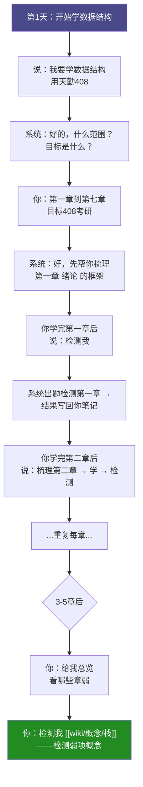
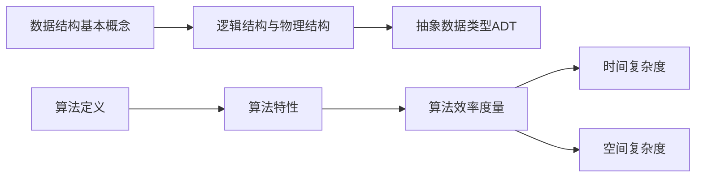

---
tags:
  - 技能集成
  - 学习流程
  - 操作指南
  - knowledge-check
created: 2026-07-19
aliases:
  - 知识检测集成指南
  - kc-learning-workflow
---

# knowledge-check × Obsidian 学习流程指南

> **本文教你**：用这个集成系统，完整学完一本书（比如《数据结构》考研408），每一步该怎么做。
> **不是你 AI 怎么工作的**——是**你该怎么说、怎么做**。

---

## 🎬 先看一个完整例子

假设你要学 **《数据结构》考研408**，以下是完整的流程时间线：



全程的核心只有 **3 句口诀**：

| 你想做什么 | 你就说什么 |
|-----------|----------|
| 开始学一本书 | `"我要学[书名]，用[资料]"` |
| 学完一章想检测 | `"检测我"` |
| 想测某个具体概念 | `"检测我 [[wiki/概念/概念名]]"` |

---

## 📖 一、用数据结构跑通全流程

### Step 0：初始化学习计划

```
你：我要学数据结构，用天勤408

系统：好的，我先问几个问题帮你搭建学习框架——
  1. 完整范围：哪些章节？（如第一章到第七章）
  2. 目标：考研？还是期末？还是自学？
  3. 已有资料：手头有什么书/视频？
```

你回答后，系统记录你的全局学习框架。**只需做一次**。

### Step 1：学每一章前——让 AI 给你搭框架

```
你：梳理第一章：绪论

系统（子代理启动）→ 生成：

## 第一章 绪论 知识框架

### 依赖关系图


### 知识点清单
| 知识点 | 标签 | 大白话 |
|--------|------|--------|
| 数据结构三要素 | [重点] | 数据长什么样+数据之间什么关系+能对它做什么操作 |
| 逻辑结构 vs 存储结构 | [重点] | 逻辑：数据之间怎么连接；存储：电脑里实际怎么放 |
| 抽象数据类型ADT | [难点] | 只告诉你"能干什么"，不告诉你"怎么实现的" |
| 时间复杂度 | [重点][易错点] | 输入规模翻倍时，运行时间翻几倍？ |
| 空间复杂度 | [易错点] | 输入规模翻倍时，内存多占几倍？ |

### 检测题集（5题）
Q1 [重点]：数据结构的三要素是什么？用自己的话解释。
...
```

**你拿着这个框架去学**——比直接看书心里有底多了。

### Step 2：学完了——检测

```
你：检测我（或 检测我 [[笔记路径]]）

系统：好，先问你几个关键问题——

🔍 Q1 [重点]：数据结构的三要素是哪三个？
   （自己解释，不用术语）

你：逻辑结构、存储结构、数据运算...

系统：逻辑结构和物理结构分清楚了吗？
   （追问——看到你有点混）

你：逻辑结构是数据元素之间的关系，物理结构是数据在计算机中的存储方式...

系统：到位了。那Q2——
   给一个例子：数组在逻辑结构上是线性结构，
   在物理结构上是什么？
...
```

### Step 3：检测完了——看结果

检测一结束，系统自动做三件事：

**① 你的对话里会看到：**

```
评级：🟡 基本理解
最薄弱：时间复杂度的计算——能把概念背出来，
        但给一个嵌套循环不会算。
行动建议：打开天勤辅导书第12页，
         做例1.3和1.4，每题先自己算再看答案。
         
检测结果已写入 [[wiki/概念/数据结构绪论]]
```

**② 笔记自动更新了——打开 [[wiki/概念/数据结构绪论]] 看看：**

YAML 多了：
```yaml
knowledge_check:
  last_detected: 2026-07-19
  mastery: 65
  weak_points:
    - 时间复杂度的计算（嵌套循环）
  next_review: 2026-07-26
```

底部多了：
```markdown
## 📊 检测记录

### [2026-07-19] 🟡 基本理解 (65%)

| 知识点 | 得分 | 判定 |
|--------|------|------|
| 数据结构三要素 | 80% | ✅ 已理解 |
| 逻辑结构与物理结构 | 70% | ✅ 已理解 |
| 抽象数据类型ADT | 60% | ⚠️ 基本理解 |
| 时间复杂度 | 45% | 🔴 未理解 |

**补漏建议：** 时间复杂度——做天勤第12页例1.3、1.4
```

**③ wiki/.log.md 多了：**
```
## [2026-07-19] detect | 数据结构绪论 | 🟡 基本理解 (65%)
- 来源：[[wiki/概念/数据结构绪论]]
- 薄弱：时间复杂度计算
```

### Step 4：学了几章后——总览全局

```
你：给我总览
```

```
## 数据结构 全局掌握情况

已检测：3/7 章（43%）
整体掌握率：72%

### 最薄弱的章
1. 第一章 绪论 — 65% — 时间复杂度计算卡住
2. 第三章 栈和队列 — 68% — 递归转栈不熟

### 🟢 已掌握
- 第二章 线性表（85%）

### 🟡 需巩固
- 第一章 绪论（65%）
- 第三章 栈和队列（68%）
```

### Step 5：想深挖一个概念——笔记锚定检测

学完第二章后，你对 **"链表"** 这概念还有点模糊。正好 wiki 里已经有概念页了：

```
你：检测我 [[wiki/概念/链表]]
```

此时系统**读取你的笔记原文**出题：

```
检测到你的笔记里写的是：
  📌 定义：由一系列结点组成，每个结点包含数据域和指针域
  📌 核心要点：
    1. 单链表、双链表、循环链表
    2. 头结点 vs 头指针
    3. 插入/删除不需要移动元素（和数组比）
    4. 查找需要遍历
  📌 关联：[[数组]]、[[栈]]、[[队列]]

好，开始检测——

🔍 Q1（概念本质）：你的笔记说"链表由结点组成"，
   那链表的结点和数组的元素，本质区别在哪？

🔍 Q2（核心要点）：你的笔记写了"插入不需要移动元素"，
   给一个具体场景：在单链表的第3个位置插入一个新结点，
   需要改几个指针？
   ...
```

检测结果一如既往——**自动写回笔记 YAML + 追加记录 + 维基日志**。

---

## 🎯 二、这个流程解决了你什么实际问题？

### 问题 1：学完一章不知道自己真懂假懂

```
以前：看完一章感觉"还行"→ 做真题发现全不会 → 心态崩了
现在：学完→"检测我"→ 系统精准指出你哪几个点没懂
      → 每个薄弱点都有"打开哪本书第几页"的补漏方案
```

### 问题 2：学过的东西经常忘

```
以前：学过两周就忘了 → 从头翻书 → 效率低
现在：检测记录在笔记里躺着，YAML 有 mastery 数值
      → 想复习时 "给我总览" → 哪章弱一目了然
      → 直接打薄弱点，不浪费时间在已掌握的内容上
```

### 问题 3：知识之间是孤岛

```
以前：数组是数组、链表是链表，学的时候是分开的
现在：概念页有 [[关联知识]]，检测会问"数组和链表什么区别"
      → 系统帮你建立知识连接
      → wiki 里的交叉链接不断完善
```

### 问题 4：学过的知识没有沉淀

```
以前：检测 → 出报告 → 报告在某个角落 → 再也没看过
现在：检测 → 结果写回笔记 YAML → 笔记就是你的"掌握度仪表盘"
      → Dataview 可以查、可以汇总、可以追趋势
```

---

## 📋 三、速查表：遇到什么情况说什么

### 学习流程类

| 你的场景 | 你说 | 系统做什么 |
|---------|-----|-----------|
| 开始学一本书 | `"我要学数据结构"` | 问范围→问目标→初始化学习框架 |
| 学完一章想了解结构 | `"梳理第一章"` | 生成知识框架 + 依赖图 + 检测题集 |
| 学完一章想检测 | `"检测我"` | 根据章节出题 → 评级 → 写回知识库 |
| 想检测一个具体概念 | `"检测我 [[wiki/概念/链表]]"` | 读取笔记原文 → 基于内容出题 → 结果写回笔记 |
| 想汇总全局情况 | `"给我总览"` | 展示各章节掌握率、薄弱章节、建议 |
| 想汇总概念掌握度 | `"给我总览 概念"` | 扫描所有带检测记录的概念页 |
| 下一章学什么 | `"接下来学什么"` | 依赖关系分析 + 学习路线推荐 |

### 维基维护类

| 你的场景 | 你说 | 系统做什么 |
|---------|-----|-----------|
| 想摄入新资料 | `"摄入 [文件名]"` | 读 → 讨论 → 建概念页 → 更新索引 |
| 想查一个主题 | `"查询 [主题]"` | 读 index → 找页面 → 综合回答 |
| 想保存回答为页面 | `"把这个答案存为页面"` | 新建概念页 → 更新 index → 更新 log |
| 想健康检查 | `"巡检"` | 检查链接、过期内容、路径完整性 |

---

## 🔄 四、一章的标准学习循环

```
┌─────────────────────────────────────┐
│         第 N 章 学习循环             │
│                                     │
│  ① "梳理第N章"                      │
│     → 拿到框架 + 依赖图 + 题集      │
│         ↓                           │
│  ② 根据框架去学习（看书/看视频）    │
│         ↓                           │
│  ③ "检测我"                         │
│     → 做检测 → 看到评级和薄弱点     │
│         ↓                           │
│  ④ 根据补漏建议针对性复习           │
│     → 打开第X页做例题               │
│         ↓                           │
│  ⑤ 如果某个点特别弱                 │
│     → "检测我 [[wiki/概念/xxx]]"    │
│     → 深挖概念                       │
│         ↓                           │
│  ⑥ 进入下一章 → 回到 ①             │
└─────────────────────────────────────┘
```

**一轮循环预计耗时：**
- 框架生成：~30 秒
- 检测：5-10 分钟
- 结果写回：自动（无需等待）
- 总额外时间：**约 10-15 分钟**（相对于纯学习时间）

---

## 📊 五、你的知识库会怎么变？

随着你一章章学、一次次检测，你的知识库会逐步长出这些数据：

### 第 1 章学完

```
wiki/概念/数据结构绪论.md
  ├── YAML: knowledge_check.mastery = 65
  └── 📊 检测记录: 1条
```

### 第 3 章学完

```
wiki/概念/
  ├── 数据结构绪论.md        (mastery: 65 → 72 → 85)
  ├── 线性表.md              (mastery: 85)
  ├── 栈.md                  (mastery: 68)
  ├── 队列.md                (mastery: 70)
  └── 链表.md                (mastery: 55 → 75)
```

wiki/.log.md 里多了 6 条 detect 记录。

### 整本书学完

```
wiki/概念/ 下有 10-15 个概念页
  每个都有 1-3 条检测记录
  每个都有 mastery 数值

你可以：
  "给我总览" → 看到整本书的掌握度热力图
  "给我总览 概念" → 看到哪些概念还没掌握
  找出掌握率最低的 3 个概念 → 逐个深挖
```

---

## ✅ 六、一句话总结

> **以前：你学你的，AI 考 AI 的，考完就忘了。**
> **现在：你从笔记学、AI 从笔记考、结果回笔记——闭环了。**

```
学一章    →  梳  理    →  学  习    →  检  测    →  结果沉淀
                                               ↓
                                        YAML 更新
                                        检测记录追加
                                        维基日志追加
```

---

*这份指南写于 2026-07-19，对应的系统集成基于 knowledge-check skill 的维基笔记锚定检测功能。*
