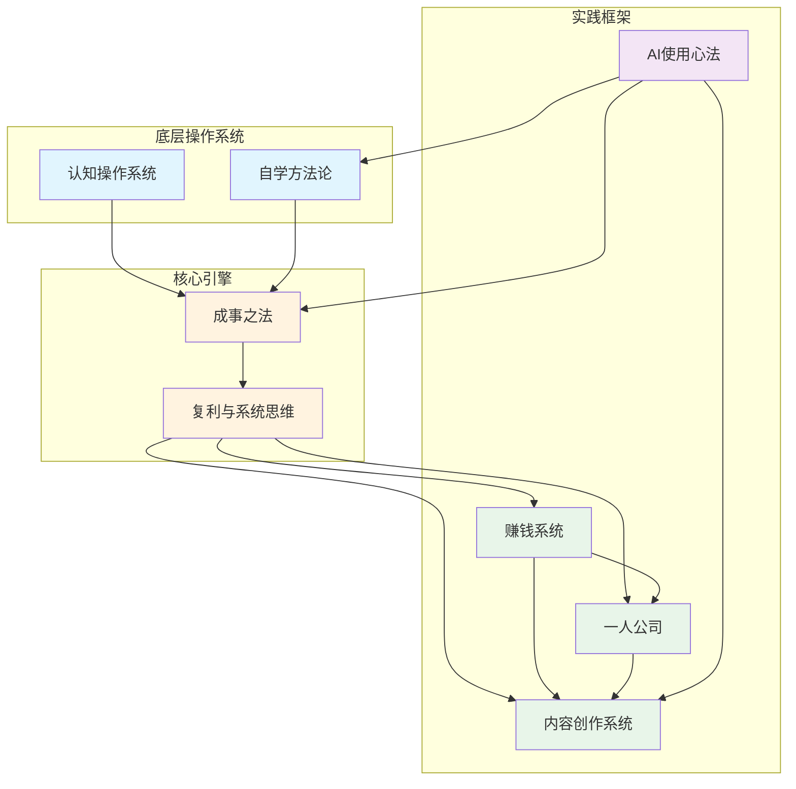

---
tags:
  - 索引
  - 知识图谱
  - MOC
created: 2026-07-21
---

# 姜胡说 思维网络总索引

> 这是一个由 AI 辅助构建的思维网络地图，连接了姜胡说自 2025年1月至2026年7月 的全部内容。447+ 条笔记，18个月的思想演化。

## 核心概念地图 (MOC)

## 概念枢纽

| 概念 | 页数 | 描述 |
|------|------|------|
| [[概念/赚钱系统]] | ~120+ | 财富路线图、信息差、赚钱公式、副业方法 |
| [[概念/成事之法]] | ~60+ | 积累效应、复利效应、蝴蝶效应、最小系统 |
| [[概念/内容创作系统]] | ~80+ | 短视频方法论、抄操超钞、AIDA、王者拍摄法 |
| [[概念/自学方法论]] | ~50+ | 拆解→对应→落地、科比学习法、关键词读书法 |
| [[概念/一人公司]] | ~40+ | 你自己就是一家公司、能力产品化、零成本创业 |
| [[概念/认知操作系统]] | ~50+ | 穷富思维、身份升级、认知建筑学、移除后门 |
| [[概念/复利与系统思维]] | ~40+ | 最小系统、杠杆、飞轮引擎、做乘法不做加法 |
| [[概念/AI使用心法]] | ~30+ | AI三重境界、AI+知识库、用AI读书四步法 |

## 核心公式与框架索引

### 财富公式（迭代演化）

| 版本 | 公式 | 来源 |
|------|------|------|
| v1 基础公式 | (喜欢 + 社会需求) × 擅长 × 1000 | [[2025-01-19_008_一条公式]] |
| v2 财富路线图 | (热情 + 社会需求) × 能力 × 影响力 | [[2025-04-02_042_财富路线图]] |
| v3 收入公式 | 收入 = 产品 × 用户数 × 复购 | [[2025-09-21_186_我是怎么一边学习一边赚钱的]] |
| v4 杠杆公式 | 收入 = 产品 × 用户数 (而非 时间 × 时薪) | [[2025-10-22_217_做副业，必须做乘法，不要做加法]] |

### 四差理论（竞争力来源）
- **信息差**：我知道你不知道 → [[2025-01-19_008_一条公式]]
- **认知差**：你以为知道但不知道 → [[2025-04-02_042_财富路线图]]
- **行动差**：别人不做你来做 → [[2026-01-20_300_两句话方法论]]
- **竞争差**：做同样的事你更好 → 多处引用

### 成事三大效应
- **积累效应**：蜗牛比青蛙更能出井 → [[2025-01-15_004_成事之法]]
- **复利效应**：做得越多，技能越强 → 同上
- **蝴蝶效应**：做成一件小事，世界不同 → 同上

### 创作四步法
- **抄** → **操** → **超** → **钞** → [[2025-08-01_137_抄操超钞]]

### 学习三阶段
- **拆解** → **对应** → **落地** → [[2026-05-26_420_我的自学方法：拆解→对应→落地]]

## 核心隐喻库

| 隐喻 | 含义 | 首次出现 |
|------|------|----------|
| 青蛙与蜗牛 | 积累比跳跃更可靠 | [[2025-01-15_004_成事之法]] |
| 竹子的故事 | 前三年打地基，第四年爆发 | [[2025-12-24_278_最小系统的力量]] |
| 你自己就是一家公司 | 个体即企业 | [[2025-01-18_007_你自己就是一家公司]] |
| 推石头上山 vs 滚雪球 | 线性劳动 vs 复利积累 | [[2025-10-22_217_做副业，必须做乘法，不要做加法]] |
| 仓鼠轮 | 忙但原地踏步 | [[2025-11-19_242_告别仓鼠式学习]] |
| 跑步机 | 努力但没进步 | [[2025-09-25_190_很努力但是没有进步？那你要换梯子了]] |
| 二年级给一年级当老师 | 知识差即商机 | 多处引用 |
| 操作系统 | 认知框架决定行为 | [[2025-09-20_185_移除危险后门，升级操作系统]] |
| 旧代码运行结果 | 现状是过去认知的产物 | [[2026-05-26_420_我的自学方法]] |
| 知识是安装不是下载 | 学习需要摩擦和应用 | [[2026-06-30_455_用AI读书的正确姿势]] |
| 文章就是源代码 | AI时代写作即编程 | [[2026-03-17_349_成事之法 Pro版]] |
| 进门的左脚 | 降低心理门槛的重要性 | [[2026-04-17_381_进门的时候，一定要迈左脚]] |

## 思维演化轨迹

### 2025年 Q1-Q2 (1月-6月)：基础建设期
- 提出核心框架：公式、成事之法、一人公司
- 聚焦"赚点小钱"的低门槛实践
- 开始探讨AI的角色

### 2025年 Q3-Q4 (7月-12月)：系统深化期
- "系统"概念成型 → 最小系统、飞轮
- 从"加法"到"乘法"的思维跃迁
- 抄操超钞框架提出
- AI使用深化

### 2026年 Q1-Q2 (1月-7月)：AI融合期
- "文章即源代码"概念
- AI+知识库工作台
- 成事之法 Pro版（AI赋能版）
- 认知操作系统升级

## 引用人物网络

| 人物 | 引用要点 | 频率 |
|------|----------|------|
| 芒格 | 按部就班学习他人即可 | 中 |
| 科比 | 所有动作都是看录影带学来的 | 中 |
| 彼得·蒂尔 | 10年的事能不能6个月搞定 | 低 |
| 巴菲特 | 睡着时也在赚钱的资产 | 低 |
| 爱因斯坦 | 疯狂是重复做同样的事期望不同结果 | 低 |
| 山姆·奥尔特曼 | 10倍增长比2倍容易 | 低 |
| 丹尼尔·卡尼曼 | 前景理论 | 低 |
| 少楠 | 对话访谈 | 1次 |
| 徐智明 | 龙之媒、快书包创始人 | 1次 |

## 推荐书籍

| 书籍 | 作者 | 提及来源 |
|------|------|----------|
| 《价值心法》 | 姜胡说 | 核心著作，大量引用 |
| 《小而美》 | - | [[2025-07-04_108_副业，做点小事]] |
| 《ANY-THING YOU WANT》 | Derek Sivers | [[2025-01-27_018_推荐几本小书]] |
| 《MILLION DOLLAR WEEKEND》 | Noah Kagan | 同上 |

## 核心矛盾与张力

姜胡说的思维中存在几个有趣的张力：

1. **简单 vs 深度**：反复强调"做好一件小事"，同时又构建了极其复杂的系统思维
2. **赚钱 vs 不为钱**：大量内容讲赚钱，但又说"放下赚钱的心态去创作"
3. **自学 vs 向他人学**：强调自学是终极技能，但同时强调"抄"、向大师学、逆向工程
4. **系统 vs 自由**：构建严密系统，但又说"要放松不要自律"
5. **AI工具 vs AI伙伴**：早期说AI是工具，后期说AI是咨询师、良师益友

---

*本索引由 Claude 基于 Karpathy Wiki 方法论构建，作为姜胡说内容的知识图谱入口。*

## 延伸阅读

- [[概念/Karpathy与姜胡子知识库方法论对比]] — Karpathy 的结构主义 vs 姜胡子的行动主义：两种 AI 知识管理范式的深入对比
