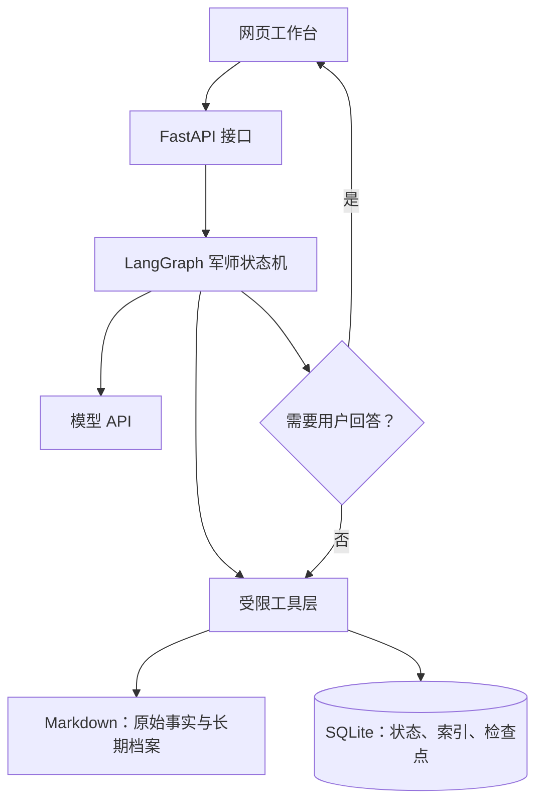
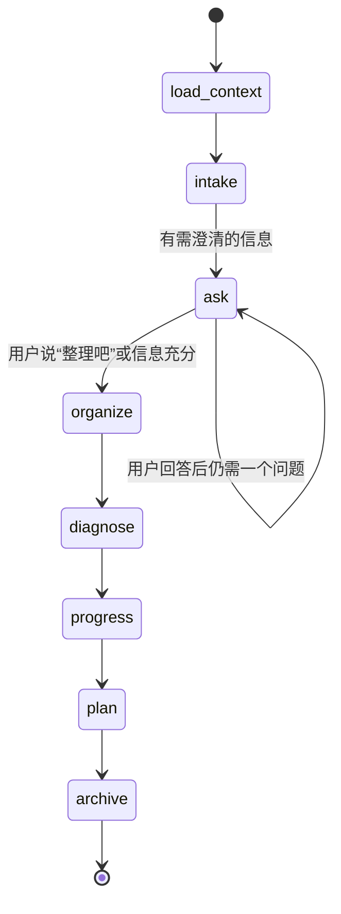

# 复盘军师 Agent 实施手册

> 目标：把“复盘军师”从一个 HTML 工作台升级为本地可运行的 Agent。它能持续追问、暂停等待你的回答、读取真实记录、更新进度、遵守周计划边界，并在证据充分时更新动态状态画像。

## 0. 先定边界：第一版做什么，不做什么

第一版只做一个**军师总控 Agent**，内部有多个固定节点；不做六个会互相聊天的 Agent，不上向量数据库，不做自动联网诊断。

原因很简单：你的核心问题是让复盘真正连续运行，而不是证明系统有多复杂。单总控 + 明确状态机已经能实现 90% 的价值，也便于发现规则哪里失效。

### MVP 验收标准

做到以下六点，第一版就可以开始每天使用：

1. 你在网页写流水账，Agent 每次只追问一个问题；
2. 你说“整理吧”后，生成原始记录和整理复盘两份 Markdown；
3. Agent 读取当天和最近记录，决定“轻诊断”或“继续观察”；
4. 项目进度只按完成证据更新；
5. 非计划日只能生成明天动作，不能修改周计划；
6. 每次判断都保存证据、未知项和置信度；单次表现不改稳定画像。

## 1. 总体架构



### 每一层的职责

| 层 | 推荐技术 | 只负责什么 |
|---|---|---|
| 界面 | 独立军师驾驶舱；MVP 复用现有 HTML，后续升级 React | 对话、日历、证据链、实验、进度与周计划可视化 |
| 接口 | FastAPI | 浏览器与 Agent 的唯一通信边界 |
| 编排 | LangGraph | 节点顺序、暂停/恢复、分支、检查点 |
| 推理 | OpenAI 或兼容模型 API | 回应、提问、结构化整理、假设生成 |
| 工具 | 自写 Python functions | 只读/写指定目录、更新项目、检查计划权限 |
| 存储 | Markdown + SQLite | Markdown 是长期真相；SQLite 是运行状态与索引 |

LangChain 的 Agent 是“模型调用工具的循环”；LangGraph 更适合本项目，因为它能让流程在追问处中断、保存状态，等你明天回来继续。LangChain 官方也说明其 Agent 建立在 LangGraph 之上。[LangChain Agents](https://docs.langchain.com/oss/python/langchain/agents) [LangGraph persistence](https://docs.langchain.com/oss/python/langgraph/persistence)

## 2. 选型与准备

### 必需条件

- Python 3.11 或更高；
- Node.js 20 或更高（只在你改前端时需要）；
- 一个模型 API Key：OpenAI API 或任意 OpenAI-compatible 服务；
- Git；
- 本知识库的本地副本。

> Codex 桌面端的对话模型不是你的后端接口。网页 Agent 需要单独的 API Key，密钥只能放 `.env`，绝不能提交 GitHub。

### 建议目录

在知识库根目录创建 `apps/review-adviser-agent/`：

```text
apps/review-adviser-agent/
├─ backend/
│  ├─ app/
│  │  ├─ main.py              # FastAPI 入口
│  │  ├─ graph.py             # LangGraph 节点与边
│  │  ├─ state.py             # 状态类型
│  │  ├─ prompts.py           # 系统提示词
│  │  ├─ schemas.py           # Pydantic 输入输出模型
│  │  ├─ tools/
│  │  │  ├─ vault.py          # 受限的 Markdown 读写
│  │  │  ├─ progress.py       # 项目进度
│  │  │  └─ planning.py       # 周计划权限检查
│  │  └─ services/
│  │     ├─ archive.py        # 生成 Markdown
│  │     └─ profile.py        # 动态画像与证据门槛
│  ├─ data/review_agent.db    # 本机运行数据，不提交
│  ├─ pyproject.toml
│  └─ .env                    # 本机密钥，不提交
├─ frontend/                  # 后续 React；MVP 可空着
└─ README.md
```

在根目录 `.gitignore` 增加：

```gitignore
apps/review-adviser-agent/backend/.env
apps/review-adviser-agent/backend/data/*.db
```

### 安装命令（PowerShell）

```powershell
cd "D:\Jerry的知识库\apps\review-adviser-agent\backend"
python -m venv .venv
.\.venv\Scripts\Activate.ps1
pip install fastapi "uvicorn[standard]" langgraph langchain langchain-openai pydantic python-dotenv aiosqlite
```

`.env`：

```env
OPENAI_API_KEY=你的密钥
OPENAI_MODEL=你实际可调用的模型名
VAULT_PATH=D:/Jerry的知识库
DATABASE_URL=sqlite:///./data/review_agent.db
```

## 3. 存储策略：Markdown 是事实，SQLite 是运行记忆

不要把人生记录只放数据库。Markdown 可在 Obsidian 直接看、Git 可追踪、即使 Agent 坏了也不会丢。SQLite 只保存机器需要快速查询和恢复的状态。

### Markdown 的固定落点

```text
系统/3-方向盘/复盘系统/
├─ 每日复盘/原始记录/YYYY-MM-DD-原始.md
├─ 每日复盘/整理记录/YYYY-MM-DD-每日复盘.md
├─ 每日复盘/诊断报告/YYYY-MM-DD-轻诊断.md
├─ 进度/项目进度.json
├─ 进度/YYYY-MM-DD-明日计划.md
└─ 画像观察/
   ├─ 动态状态画像.md
   └─ 稳定画像候选.md
```

### SQLite 最小表

| 表 | 关键字段 | 用途 |
|---|---|---|
| `threads` | `id, review_date, status, updated_at` | 一次复盘会话能暂停和恢复 |
| `messages` | `thread_id, role, content, created_at` | 展示完整问答历史 |
| `projects` | `id, name, target, deadline, stage, evidence, next_action` | 进度面板的可查询版本 |
| `weekly_plans` | `week_key, version, content, changed_at, reason` | 保留周计划版本和改动理由 |
| `portrait_observations` | `date, claim, evidence, counter_evidence, confidence, layer` | 动态状态/稳定候选的证据池 |

LangGraph 自己的 checkpointer 也需要一个 SQLite 或 Postgres 后端，用于保存图运行到哪个节点。它和业务表可以共用数据库，但表职责要分清。

## 4. 先写数据契约，再写模型提示词

模型的自由输出必须被收进固定结构，否则它会把“感觉”当“事实”。先定义 `schemas.py`：

```python
from pydantic import BaseModel, Field
from typing import Literal

class Evidence(BaseModel):
    source_date: str
    quote_or_fact: str
    kind: Literal["fact", "feeling", "user_explanation", "hypothesis"]

class CandidateIssue(BaseModel):
    claim: str
    supporting: list[Evidence]
    unknown_or_counter: list[str]
    confidence: Literal["low", "medium", "high"]

class NextAction(BaseModel):
    when_where: str
    smallest_action: str
    proof: str

class ReviewTurn(BaseModel):
    response: str
    next_question: str | None = None
    ready_to_organize: bool = False

class DailyDiagnosis(BaseModel):
    progress: list[str]
    signals: list[Evidence]
    candidates: list[CandidateIssue]
    primary_issue: CandidateIssue | None = None
    experiment: str | None = None
    next_action: NextAction
```

**硬规则：** 若缺少跨日证据，`primary_issue` 只能是低/中置信度的暂定假设；若当天没有足够信号，值必须为 `None`。

## 5. LangGraph 状态机

### 状态定义

```python
from typing import TypedDict, Literal

class AdviserState(TypedDict, total=False):
    thread_id: str
    review_date: str
    phase: Literal["intake", "ask", "organize", "diagnose", "progress", "plan", "archive", "done"]
    raw_text: str
    dialogue: list[dict]
    recent_reviews: list[str]
    progress_snapshot: list[dict]
    weekly_plan: dict | None
    organized_review: str
    diagnosis: dict | None
    tomorrow_plan: dict | None
    dynamic_portrait_update: dict | None
```

### 图的节点与跳转



节点不要全都调用模型：

| 节点 | 类型 | 输入 | 输出 |
|---|---|---|---|
| `load_context` | 代码 + 工具 | 日期、thread_id | 最近复盘、项目、周计划、动态状态 |
| `intake` | 模型 | 流水账 | 共情回应 + 一个问题 |
| `ask` | 模型 + interrupt | 上一轮回答 | 回应 + 一个问题，或允许整理 |
| `organize` | 模型结构化输出 | 已确认事实 | 第一人称 Markdown |
| `diagnose` | 模型结构化输出 | 成稿 + 近期证据 | 轻诊断或“继续观察” |
| `progress` | 工具优先 | 用户确认的完成项 | 更新后的项目数据 |
| `plan` | 规则 + 模型 | 今日结果、周计划 | 明日动作；必要时拒绝改周计划 |
| `archive` | 代码 | 全部状态 | 写 Markdown、数据库记录、动态画像 |

### 为什么追问必须 `interrupt`

不要让模型在一次 HTTP 请求里幻想 5 轮问答。节点提出一个问题后调用 `interrupt()`，接口把问题发回网页；用户回答后用同一个 `thread_id` 恢复图。这样“明天再答”也不会丢上下文。

伪代码：

```python
from langgraph.types import interrupt

def ask_node(state: AdviserState):
    turn = ask_model_for_one_question(state)
    if turn.ready_to_organize:
        return {"phase": "organize"}
    answer = interrupt({"type": "question", "text": turn.next_question})
    return {"dialogue": state["dialogue"] + [{"q": turn.next_question, "a": answer}]}
```

实际调用时为图配置 `thread_id`；恢复时传入用户回答，而不是重新调用“开始复盘”。这是本项目采用 LangGraph 的核心价值。

## 6. 工具层：模型没有文件系统自由权限

模型只能调用你注册的窄工具，不能直接拿到 `D:\Jerry的知识库` 的任意写权限。

### 必须实现的工具

```text
read_recent_reviews(days=7)          只读整理复盘与诊断报告
read_progress()                      读取项目进度 JSON/SQLite
update_project(id, patch, evidence)  有完成证据才更新
read_weekly_plan(week_key)           读取当前版本
can_change_week_plan(today, reason)  返回 allow/deny 与理由
write_review_artifact(kind, date, content)
append_portrait_observation(...)
```

`vault.py` 的关键防线：

```python
from pathlib import Path

VAULT = Path(os.environ["VAULT_PATH"]).resolve()
ALLOWED = (VAULT / "系统" / "3-方向盘" / "复盘系统").resolve()

def safe_path(relative: str) -> Path:
    target = (ALLOWED / relative).resolve()
    if ALLOWED not in target.parents and target != ALLOWED:
        raise ValueError("拒绝访问复盘系统目录以外的文件")
    return target
```

第一版禁止：删除文件、覆盖原始记录、自动修改 `user-profile.md`、执行 shell 命令、自动联网。

## 7. 提示词不要写成一篇长人格分析

把 `prompts.py` 分成四段短协议，并把真正的行为规则放在代码和工具权限里。

### 军师总控系统提示词骨架

```text
你是 Jerry 的复盘军师总控。
目标：帮助 Jerry 从事实走向可验证行动，而非替他下人格结论。
规则：
1. 一次只问一个信息增益最高的问题；先回应，再提问。
2. 区分事实、感受、用户解释、诊断假设。
3. 单次表现只能是待观察信号；稳定画像需要跨周期证据和反证。
4. 非计划日不得改周计划，只能生成明日具体动作。
5. 没有证据时，明确说不知道并提出观察方式。
6. 直接反馈格式：暂定判断 → 证据 → 影响 → 验证动作。
```

然后按节点追加局部提示词：

- `ask`：只允许生成“回应 + 一个问题”；
- `organize`：要求第一人称 Markdown，AI 推断只能进待观察；
- `diagnose`：要求输出 `DailyDiagnosis`；
- `plan`：只允许输出 `NextAction` 和有限字段。

现有的 `daily-interactive-review`、`problem-diagnosis-learning` 与 `review-adviser` Skill 是你的领域协议来源；实现时把它们提炼为这些节点的简短规则，而不是每次把全部 Skill 文件塞给模型。

## 8. FastAPI 接口

第一版只需四个接口：

| 方法 | 路径 | 用途 |
|---|---|---|
| `POST` | `/api/reviews` | 创建今天的复盘线程并提交流水账 |
| `POST` | `/api/reviews/{thread_id}/reply` | 回答当前军师问题，恢复图 |
| `GET` | `/api/reviews/{thread_id}` | 获取状态、对话和当前待办 |
| `GET` | `/api/calendar?month=YYYY-MM` | 返回日历中已有记录的摘要 |

创建请求例子：

```json
{
  "date": "2026-07-26",
  "raw_text": "今天上午……",
  "mode": "daily"
}
```

返回例子：

```json
{
  "thread_id": "rvw_01J...",
  "phase": "ask",
  "message": "我听到你……",
  "question": "你说效率下降，最近一次从顺利变得卡住发生在哪一步？"
}
```

前端只做两件事：展示返回的内容；把用户下一句话连同 `thread_id` 发回去。前端不要自己判断该进入诊断还是计划，所有流程判断由后端图完成。

## 9. 计划与画像的硬编码规则

这些规则不要只依赖模型理解，应由 Python 函数先裁决。

### 周计划权限

```python
def can_change_week_plan(today: date, reason: str | None) -> tuple[bool, str]:
    is_week_start = today.weekday() == 0       # 周一
    is_midweek = today.weekday() == 3          # 周四，可自行修改
    emergency = reason in {"health", "external_deadline", "invalid_assumption"}
    if is_week_start or is_midweek or emergency:
        return True, "允许校准，并记录原因"
    return False, "今天是执行日：只生成明天动作，改动写入待周中校准"
```

### 稳定画像门槛

```python
def can_propose_stable_profile(observations: list[Observation]) -> bool:
    dates = {o.date for o in observations if o.supports_claim}
    has_counter = any(o.counter_evidence for o in observations)
    return len(dates) >= 3 and has_counter
```

即使返回 `True`，也只能写入 `稳定画像候选.md`，向你展示证据后等待确认；确认接口才可以修改 `wiki/自我认知/user-profile.md`。

## 10. 开发顺序：每完成一步就能运行

不要第一天就做完整网页。按以下顺序，每一项都可验证：

1. **骨架**：FastAPI 返回固定 JSON；浏览器能请求到 `/docs`。
2. **单轮复盘**：接收流水账，模型只返回回应和一个问题。
3. **暂停恢复**：接上 LangGraph checkpointer；关掉页面后仍能用 `thread_id` 继续。
4. **归档**：用户说“整理吧”后，生成两份 Markdown；人工检查内容没失真。
5. **进度工具**：增加一个项目、按证据更新一个小阶段。
6. **计划规则**：在非计划日测试“试图改周计划”是否被拒绝。
7. **轻诊断**：读取最近 2—3 天，输出带证据和未知项的 JSON。
8. **动态画像**：只写状态观察；连续运行至少 7 天后再调规则。
9. **再做驾驶舱 UI**：把现有 HTML 从 localStorage 改为调用 API；优先实现日历、问题证据链、实验看板和项目进度，再考虑 React 和更复杂图表。详见 [四大核心引擎设计](复盘军师四大核心引擎设计.md)。

## 11. 测试清单

每次改图或提示词，至少跑这些人工测试：

| 场景 | 预期 |
|---|---|
| “今天效率很差” | 军师追问一个具体事件，不诊断懒惰 |
| 用户连续三次回答 | 每次仍只问一个问题 |
| 用户说“整理吧” | 停止追问，生成整理复盘 |
| 当天情绪差但有完成 | 同时记录进步和状态，不写人格结论 |
| 周二要求推翻周计划 | 拒绝改周目标，仅给明日动作 |
| 三天重复同一阻塞 | 可提出低/中置信度趋势假设，附日期证据 |
| 一次状态不好 | 不写入稳定画像 |
| 原始记录已存在 | 不覆盖；新建版本或要求用户确认 |

同时保留一组匿名/脱敏的“黄金复盘样本”，每次改提示词后比较：是否多问、是否越权诊断、是否把事实改写失真。

## 12. 何时才值得升级

满足下列条件前，不要上 RAG、多 Agent、向量库或自动研究：

- 你已连续使用至少 14 天；
- 已有 10 份以上整理复盘；
- 能明确指出一个当前系统解决不了的摩擦；
- 这个摩擦不是“我想让它更酷”，而是每周真实浪费时间。

升级路径：

1. 记录多到全文检索慢 → 加 SQLite FTS；
2. 需要跨大量知识库引用 → 再加 RAG；
3. 日复盘稳定、周诊断复杂 → 把“周诊断”拆成独立子图；
4. 需要观察模型质量 → 接 LangSmith 或本地结构化日志。

不要因为“每个板块像老师”就立刻拆成多 Agent。第一版中，它们是图里的专业节点；只有当节点真的需要独立记忆、独立工具或并行任务时，才值得拆成 Agent。

## 13. 你现在的第一步

先完成第 1—3 步：建后端骨架、让模型只问一个问题、实现暂停恢复。完成后用你真实的一天复盘测试一次，再决定是否继续做归档与进度。

这会让你通过“做出一个能用的军师”学习 LangGraph，而不是先读完框架再开始。

## 参考

- [四大核心引擎设计](复盘军师四大核心引擎设计.md)
- [LangChain Agents 官方文档](https://docs.langchain.com/oss/python/langchain/agents)
- [LangGraph 状态与图 API](https://docs.langchain.com/oss/python/langgraph/graph-api)
- [LangGraph 持久化与检查点](https://docs.langchain.com/oss/python/langgraph/persistence)
- [复盘军师工作流](复盘军师工作流.md)
- [复盘军师统一总控 Skill](../../../.agents/skills/review-adviser/SKILL.md)
