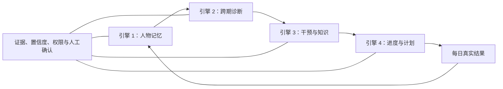
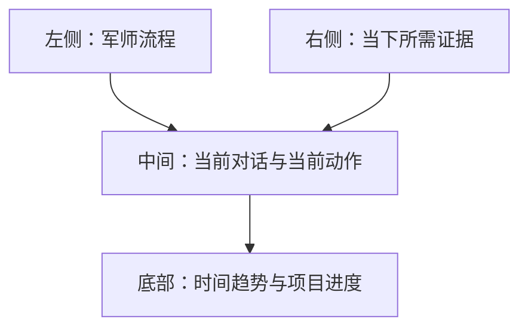
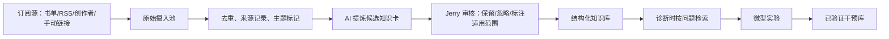

# 复盘军师的四大核心引擎

> 界面、模型和 LangGraph 都只是手脚。军师真正的能力来自：持续、可证伪地理解一个人；从时间中看模式；把问题变成干预实验；再把实验落成有限的计划。

## 总原则：不是“比你更懂你的内心”，而是比你更系统地记住证据

一个可靠的军师不应该宣称“我比你更了解你自己”。它无法直接知道你的真实动机，也不该把推测当事实。

它应当做到更强的四件事：

1. 记得你分散在不同日期、不同语境中的事实；
2. 看见你当下难以看见的重复模式、反例和变化；
3. 把判断明确标成假设，并用行动验证；
4. 被新证据推翻时，主动修正，而不是维护旧画像。

这才是“军师感”的来源：不是神秘洞察，而是连续证据、清晰推理和有效行动。



## 产品定位：LLM 是大脑，应用是驾驶舱，Obsidian 是档案库

你不需要的是“Obsidian + 一个 AI 聊天框”，而是一个独立的**个人军师驾驶舱**：LLM 在后台读取证据、调用工具、提出追问与生成判断；你在前台看见时间、证据、问题、实验和计划之间的关系。

| 角色 | 应该是什么 | 不应该是什么 |
|---|---|---|
| LLM | 军师大脑：提问、综合、假设、解释、生成行动草案 | 无证据地贴人格标签的算命者 |
| Web 应用 | 主操作界面：对话、日历、趋势、进度、实验与计划 | 单纯展示 Markdown 的页面 |
| Obsidian | 可编辑、可回溯、可 Git 备份的长期档案库 | 每日军师交互的唯一界面 |
| LangGraph + 工具 | 军师的工作流、记忆选择、规则和写入权限 | 用来替代你做价值判断的黑箱 |

### 主驾驶舱布局



左侧不是一串静态按钮，而是军师当前所处的阶段：复盘、追问、诊断、实验、进度、计划。中间永远只放“现在该做什么”；右侧根据阶段动态显示证据；底部让你看到连续变化，而不是只读今天的一段文字。

### 必须有的六个可视化面板

| 面板 | 你看见什么 | 它解决什么 |
|---|---|---|
| 复盘日历 | 每日是否完成、悬停摘要、诊断/实验标记 | 进入任意日期和时间脉络 |
| 状态时间线 | 精力、情绪、启动、深度工作等由你确认的轻量信号 | 看趋势，不凭一天状态判断自己 |
| 问题证据链 | “现象 → 日期证据 → 反证 → 当前假设 → 下一步验证” | 让军师的判断可质疑、可修正 |
| 实验看板 | 正在做的 1—3 天实验、指标、复诊日期、结果 | 不让建议停在文字里 |
| 项目进度面板 | 项目阶段、完成证据、阻塞、截止日、下一步 | 计划基于现实而不是愿望 |
| 周计划面板 | 周目标、计划版本、周中改动原因、待校准事项 | 防止每天重写战略 |

### 一个关键界面原则

不要做人格雷达图、情绪分数总评或“自律指数”。这些图很漂亮，但会诱发你把自己当成被打分的对象。

更有用的图是**证据图**：哪天发生了什么、什么条件下更有效、哪个实验结果支持或推翻了哪个假设。它帮助行动，不替你下审判。

### LLM 在每个面板实际做什么

| 面板 | LLM 的工作 | 代码/数据库的工作 |
|---|---|---|
| 复盘 | 回应、一次一问、整理原话 | 保存线程与日期 |
| 状态时间线 | 把文本提炼为待确认的状态点 | 按日期画线和筛选 |
| 证据链 | 生成候选解释、列反证和未知 | 保存来源、置信度和版本 |
| 实验 | 根据问题匹配干预、解释原因 | 计时、提醒、记录指标 |
| 项目进度 | 帮你拆阶段、识别阻塞 | 计算进度、截止日与版本 |
| 周计划 | 给出容量建议和明日动作 | 强制执行计划日权限 |

因此，LLM 是大脑，但不是数据库、图表库或规则裁判。让模型处理语言与推理；让代码处理日期、权限、版本、证据链接和可视化。

## 0. 五层数据治理：四个引擎共同使用的地基

不要把所有文本都塞进模型上下文。每条信息进入系统时，必须先决定它属于哪一层。

| 层 | 保存什么 | 例子 | 谁能修改 |
|---|---|---|---|
| 原始事实 | 原话、流水账、问答、完成证据 | “14:00 做了两道题，第二题不会” | Jerry；Agent 只能追加 |
| 整理事实 | 确认后的日/周复盘 | 当天内容的第一人称成稿 | Jerry 确认后 Agent 写入 |
| 推理层 | 信号、候选问题、反证、置信度 | “连续三天启动延迟，低置信度” | Agent 提议，持续复诊 |
| 知识层 | 书、视频、笔记提炼出的干预卡 | “低状态启动：15 分钟保底法” | 摄入流程 + Jerry 审核 |
| 决策层 | 项目、周计划、明日行动、实验 | “周四校准；明早 8:30 做第 3 题” | Jerry 最终确认 |

任何一句“你就是……”“你真正的问题是……”都不能直接写入长期画像。它必须先经过：**来源 → 证据 → 反证 → 置信度 → 时间窗口 → 用户确认**。

---

# 引擎一：人物记忆与人物画像

## 1.1 不用一份“人格报告”记住你，而是维护四种记忆

| 记忆 | 内容 | 更新频率 | 失效规则 |
|---|---|---|---|
| 稳定画像 | 相对稳定的价值、偏好、能力、常见风险、沟通方式 | 月度/确认后 | 新的长期反证出现时修订 |
| 动态状态 | 当前目标、精力、环境、项目、实验、近期压力 | 每日/每周 | 默认 14 天后重新确认 |
| 行为证据 | 具体日期、行为、结果、原话 | 每次复盘 | 不失效，只能补充上下文 |
| 对话记忆 | 当前未完成的追问、承诺、偏好 | 每次会话 | 任务结束后归档或过期 |

对于你，稳定画像可以保留“擅长系统化和深度反思、容易让分析替代行动”这种**已有多次证据**的观察；但“这周状态不好”只能进动态状态，不能强化成性格结论。

## 1.2 每条画像观察必须长成一张证据卡

```yaml
id: obs-2026-07-26-001
layer: dynamic                 # dynamic | stable_candidate
claim: 最近三天高数任务启动阻力上升
confidence: low
evidence:
  - date: 2026-07-24
    type: fact
    text: "……"
  - date: 2026-07-26
    type: user_explanation
    text: "……"
counter_evidence:
  - date: 2026-07-25
    text: "在图书馆能连续完成一小时"
alternative_explanations:
  - 睡眠不足
  - 任务定义不清
next_observation: 连续三天记录启动时间、地点与第一步
expires_on: 2026-08-09
```

这张卡的价值是：它强迫系统保留反例。若图书馆能正常启动，就不能把问题粗暴叫做“自律差”。

## 1.3 画像更新算法

每次最终复盘归档后运行一次“记忆提取”，但它只提取候选，不直接改画像。

```text
最终复盘 + 追问问答
→ 提取事实/感受/本人解释
→ 与已有状态、项目和近 7 天记录比对
→ 新证据卡（动态）或更新旧卡
→ 每周把证据卡汇成趋势
→ 每月才产出稳定画像候选
→ Jerry 确认后才修改稳定画像
```

### 稳定画像准入门槛

必须同时满足：

- 至少三个不同日期的独立事实，或至少两个不同周周期；
- 至少一个反证或合理替代解释；
- 不是只由情绪、语气或模型猜测支持；
- 能说清它对计划或沟通有什么实际作用；
- Jerry 看过证据并确认。

## 1.4 技术实现

第一版不必上向量库。先用 SQLite 保存 `portrait_observations`，并用日期、领域、项目、标签检索；文本文件用 SQLite FTS 或普通全文搜索。

后续只有出现“数百篇复盘里找不到相似经历”的真实问题时，再为**整理复盘与知识卡**建立向量索引。原始流水账、稳定画像和隐私文件不要无差别上传到第三方嵌入服务。

### 最小表结构

```sql
CREATE TABLE portrait_observations (
  id TEXT PRIMARY KEY,
  layer TEXT NOT NULL,
  claim TEXT NOT NULL,
  confidence TEXT NOT NULL,
  evidence_json TEXT NOT NULL,
  counter_evidence_json TEXT NOT NULL,
  status TEXT NOT NULL,        -- active | expired | confirmed | rejected
  expires_on TEXT,
  created_at TEXT NOT NULL
);
```

---

# 引擎二：跨天、跨周、跨月的状态与问题诊断

## 2.1 先把复盘文本变成可比较的“事实切片”

只读一堆 Markdown 并让模型“凭感觉总结”，会导致它每周换一个说法。每天成稿后，额外抽取一份结构化事实切片：

```json
{
  "date": "2026-07-26",
  "domains": ["高数", "408", "身心"],
  "completed": [{"project": "高数", "evidence": "独立完成第3题"}],
  "blocks": [{"event": "14:00 打开课程后刷手机", "context": "宿舍", "impact": "40分钟"}],
  "state": {"energy": "low", "sleep_hours": null},
  "effective_conditions": ["图书馆先做题再看课"],
  "user_explanations": ["可能是任务太大"],
  "tomorrow_action": "……"
}
```

它不是量化你的人生，而是让系统能回答：同一个阻塞在哪天、什么环境、哪个任务、什么身体状态下出现过。

## 2.2 四种时间窗口，不混用

| 窗口 | 目的 | 可以得出的结论 |
|---|---|---|
| 当天 | 澄清事实和明天行动 | 信号、待观察，不做长期归因 |
| 3—7 天 | 发现重复、比较条件 | 暂定模式与小实验 |
| 2—4 周 | 看计划偏差、实验结果、趋势 | 阶段主要矛盾与周计划调整 |
| 1—3 月 | 看能力、习惯、目标是否变化 | 稳定画像候选与系统升级 |

你最在意的“跨天跨月不停分析”不是每天都输出一份长报告，而是：**每天轻量提取，周度综合判断，月度修订认识。**

## 2.3 诊断流程

```text
事实切片
→ 按领域与时间窗口聚合
→ 发现重复信号 / 反例 / 计划偏差
→ 生成 2—4 个候选解释
→ 对每个解释列支持证据、反证、未知与置信度
→ 按阻断力、杠杆性、证据度、可验证性排序
→ 只选一个“当前暂定主要矛盾”
→ 设计实验，并在后续记录中复诊
```

### 主动预警门槛

不要因为一个坏日子就报警。下面是合理的默认阈值，之后可用真实数据调整：

| 信号 | 预警条件 | Agent 的动作 |
|---|---|---|
| 同一任务启动失败 | 7 天内 ≥3 次，且有具体事件 | 提出低/中置信度候选，问一个区分问题 |
| 项目延期 | 截止前连续两次没有完成证据 | 标记阻塞，要求拆小下一步 |
| 睡眠/精力下降 | ≥3 天连续记录，或明显影响任务 | 优先检查身体、环境与容量，不道德化 |
| 计划频繁改动 | 非计划日 ≥2 次要求推翻周目标 | 阻止改计划，留到周中校准 |
| 分析增加、闭环减少 | 两周内长篇分析多但完成证据少 | 明确提示这是待验证假设，安排最小闭环 |

### 报告格式

每份周/月诊断都必须保留：

```markdown
## 已确认事实与进步
## 重复信号（日期与来源）
## 候选解释
| 候选 | 支持证据 | 反证/未知 | 置信度 |
## 当前主要矛盾（暂定）
## 本期实验的结果
## 下期只收集什么证据
```

这会让军师“不断理解你”，却不陷入每次换一个心理解释的幻觉。

## 2.4 技术实现

实现三个后台作业即可：

1. `extract_daily_facts(date)`：归档后提取事实切片；
2. `build_weekly_pattern(week_key)`：读取 7 天切片、进度、计划版本；
3. `build_monthly_review(month_key)`：读取四周结果，产出稳定画像候选。

这些作业可以先由你点击按钮触发。等连续使用稳定后，再用 Windows Task Scheduler、APScheduler 或队列定时运行；定时只负责**生成草稿和提醒**，不应自动替你修改周计划或画像。

---

# 引擎三：问题干预与知识库

## 3.1 解决方案不是“模型给建议”，而是一条可复诊的干预链

```text
问题现象
→ 候选原因（带反证）
→ 选择一个最可验证的原因
→ 匹配一种干预机制
→ 一个微小动作
→ 1—3 天实验
→ 7 天复诊
→ 保留 / 修改 / 放弃
```

因此每一份方案都必须回答：

1. **为什么是这个问题，而不是另一个？**——引用证据；
2. **为什么用这个办法？**——说明它改变哪个变量；
3. **怎么开始？**——第一步不超过 15 分钟；
4. **持续多久？**——明确 1—3 天或一周；
5. **什么结果说明它有效？**——一个行为指标和一个结果/感受指标；
6. **无效怎么办？**——下一条分支，而不是责备自己。

### 干预卡模板

```yaml
title: 低状态启动的15分钟保底闭环
solves: [任务启动困难, 低能量日]
mechanism: 降低任务体积与选择成本，先获取一次完成反馈
applicable_when:
  - 已确认任务本身并非完全不会
  - 当天精力低或启动阻力高
not_for:
  - 连续严重睡眠/身体异常
  - 明确的知识前置缺口
micro_action: 打开指定材料，只做一道最小题或15分钟主动回忆
duration: 连续3天
metrics:
  - 是否在约定时间开始
  - 是否产生完成证据
review_rule: 3天后比较启动率；无改善则检查环境、任务定义或前置知识
sources:
  - type: book
    title: 具体书/章节
```

一次诊断最多匹配：**一个主干预 + 一个补充资源**。书、课程、抖音视频都不是“多多益善”的药方；它们只有在能支持正在验证的一个动作时才进入计划。

## 3.2 需要一个“干预知识库”，但不是把资料全喂给模型

你说得对，长期看确实需要吸收书籍、博主、论文、视频和自己的实践。但它应当有三层：

| 层 | 内容 | 是否直接影响建议 |
|---|---|---|
| 原始素材库 | 书摘、视频、文章、抖音/哔哩哔哩笔记 | 否，只能检索 |
| 结构化知识卡 | 来源、核心主张、适用条件、反例、微动作 | 可作为候选依据 |
| 已验证干预库 | Jerry 实际试过的做法、结果与适用场景 | 优先级最高 |

真正应该让军师优先调用的是第三层：**对 Jerry 已有效的方法**。外部知识只负责提出新假设，不能压过你的真实结果。

### 知识卡字段

```yaml
id: kc-...
source_type: book | creator_video | paper | local_note
source_title: ...
source_url: ...
claim: 这个方法的核心主张
mechanism: 它改变什么变量
applicable_when: []
counterexamples: []
micro_practice: ...
quality: primary | secondary | personal_experience
status: inbox | reviewed | active | retired
```

## 3.3 定时获取内容：可以，但必须经过“候选摄入池”

可以增加一个定时内容板块，负责从你授权的来源抓取新增内容。但绝不能让它自动把一条短视频变成你的人格结论或治疗方案。

正确流程：



### 第一版的摄入方式

先不要自动爬抖音。原因是登录、反爬、版权、内容质量和平台规则都会让系统变脆。

第一版只做两种低摩擦入口：

1. 你在工作台粘贴一个链接或一段笔记；
2. 订阅你明确选择的 RSS、Newsletter、YouTube/Bilibili 频道更新（仅元数据和你有权保存的摘要）。

每天或每周定时任务只做：拉取 → 去重 → 放入 `知识摄入/待审核` → 通知你。你审核后，系统才生成可检索的知识卡。

### 内容质量规则

- 书籍/论文/官方文档优先于切片短视频；
- 短视频可作为经验线索，不能单独作为诊断依据；
- 每张卡都必须写“适用条件”和“不适用条件”；
- 与本地实践冲突时，优先保留冲突并设计小实验；
- 不把“收藏”算学习，不把“看过”算掌握。

## 3.4 干预时间尺度

| 类型 | 适合时长 | 例子 |
|---|---|---|
| 当日微动作 | 5—15 分钟 | 先做一题、写出启动阻力发生时刻 |
| 小实验 | 1—3 天 | 连续三天在图书馆先做题再看课 |
| 行为方案 | 7 天 | 固定启动提示、记录开始时间 |
| 系统调整 | 2—4 周 | 调整周容量、学习闭环、环境设计 |
| 方向/画像判断 | 1—3 月 | 判断何种学习方式长期有效 |

对于你，要特别防止“为了理解解决方案又读十本书”。干预卡必须先带一个今天能做的微动作；没有动作的知识卡只能留在素材库。

---

# 引擎四：进度、计划与执行面板

## 4.1 计划不是军师替你安排人生，而是约束下一步

计划引擎的输入只能来自：确认过的目标、真实项目进度、当前容量、已验证/正在验证的干预，以及周计划边界。

它的职责不是填满日程，而是把真实目标变成下一次可完成的闭环。

### 项目数据模型

```yaml
id: math-limit
name: 高数极限
goal: 完成当前章节的理解、练习与错题闭环
deadline: 2026-08-15
stage: 例题迁移练习
progress_evidence:
  - date: 2026-07-26
    proof: 独立完成第3题，错题已标注
next_action: 图书馆完成第4题并口述思路
estimate_days: 4
status: active                  # active | blocked | delayed | done
blocker: null
```

项目“完成度”不要只写 60%。更重要的是它处于哪一阶段、最近有什么证据、下一步能否启动。

## 4.2 三层计划纪律

| 层 | 节奏 | 输出 | Agent 权限 |
|---|---|---|---|
| 阶段目标 | 月度/里程碑 | 目标、截止日、阶段拆分 | 提建议，Jerry 确认 |
| 周计划 | 周初 + 周中 | 优先级、容量、项目顺序 | 只有计划日可修改并记录原因 |
| 日计划 | 每日复盘末 | 明天第一件事、主线、保底版 | 可自动生成草案，不改周战略 |

日计划模板固定为：

```text
明天第一件事：时间 / 地点 / 最小动作 / 完成证据
主线闭环：一个
可选副线：最多一个
低状态保底版：15 分钟内
```

这对你尤其重要：当一天表现差时，军师要调小下一步，而不是陪你重写一整周来获得“重新开始”的感觉。

## 4.3 计划生成顺序

```text
读取本周不可变优先级
→ 读取项目当前阶段与完成证据
→ 检查今天的精力/健康和诊断结论
→ 选择一个最有杠杆的主线闭环
→ 设定明天第一件事与保底版
→ 写入计划草案
→ Jerry 确认后归档
→ 次日用完成证据复盘，不用情绪打分
```

### 计划失真时的处理

| 现象 | 军师不要做 | 军师应该做 |
|---|---|---|
| 一天没完成 | 直接重排整周 | 记录阻塞，生成保底版，等计划日校准 |
| 连续延期 | 继续加任务 | 检查阶段拆分、估时、前置与容量 |
| 状态差 | 归因于意志力 | 优先检查睡眠、环境、任务体积、身体 |
| 新机会出现 | 立即替换主线 | 放入待周中校准并评估机会成本 |

---

# 四引擎如何落地到 LangGraph

不要将四个引擎做成四个自由聊天的模型。它们应该是一个状态图中的四组**受限节点 + 工具**：

```text
load_memory
  → review_conversation
  → archive_facts
  → longitudinal_diagnosis
  → intervention_match
  → progress_sync
  → plan_guard
  → archive_and_update_dynamic_state
```

其中：

- `load_memory`：按问题加载相关记忆，不把完整人生画像都塞给模型；
- `longitudinal_diagnosis`：只读事实切片、实验结果、证据卡；
- `intervention_match`：先检索已验证干预库，再检索知识卡；
- `plan_guard`：用代码检查计划日，不让模型自行决定规则；
- `archive_and_update_dynamic_state`：只更新动态观察，稳定画像走确认流程。

## 推荐开发阶段

| 阶段 | 先完成什么 | 验收问题 |
|---|---|---|
| A | 复盘问答 + 原始/整理归档 | 是否每轮只问一题、可恢复？ |
| B | 事实切片 + 7 天趋势 | 是否能列出具体日期证据和反证？ |
| C | 项目与计划守卫 | 是否能阻止执行日重写周计划？ |
| D | 干预卡 + 三天实验 | 是否每个建议都有微动作与复诊？ |
| E | 内容摄入池 | 新内容是否必须审核才能影响建议？ |
| F | 月度画像候选 | 是否从不自动改稳定画像？ |

先连续运行 A—D 两周，确认它确实帮你多完成闭环，再开发 E。内容摄入很容易带来“资料增长快于实践增长”的假繁荣。

## 你现在最应该先做的一个功能

不是定时爬内容，也不是先做 RAG，而是“**事实切片 + 证据卡**”。

没有它，系统只是在每次对话里写得很懂你；有了它，系统才开始能跨天记住：什么发生过、哪天发生、哪些反例存在、下一步该怎么验证。

## 关联文档

- [[复盘军师工作流]]
- [[复盘军师Agent实施手册]]
- [[画像观察/动态状态画像]]
- [[画像观察/稳定画像候选]]
